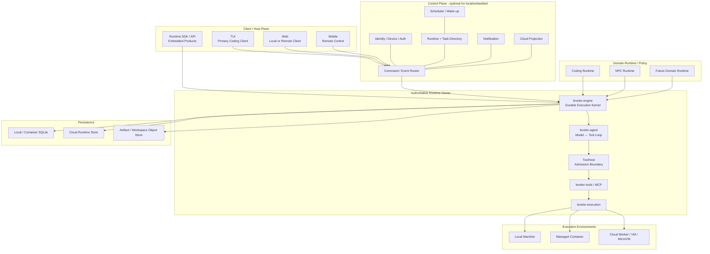
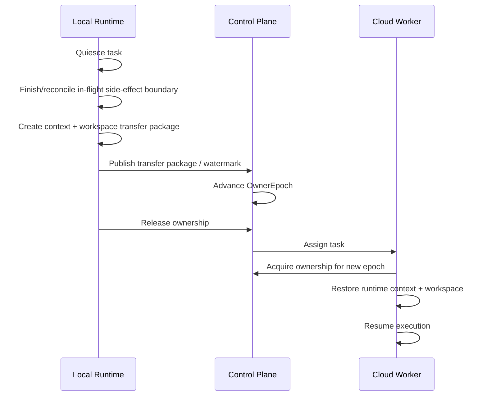

# CodeLeveler Future Runtime Architecture

> Status: Target Architecture  
> Scope: Long-term product and runtime direction  
> Current implementation reference: `docs/ARCHITECTURE.md`  
> Principle: this document describes the **target state**. A capability described here must not be presented as implemented until the code and acceptance gates exist.

## 1. Product definition

CodeLeveler should evolve from a reliable local Coding Agent into a **Durable Agent Runtime**.

The user does not need to remain in front of one terminal while work is executing. The user submits a goal to a runtime, the runtime executes that work locally, in a managed container, or in the cloud, and the user may observe and control the same task from TUI, Web, Mobile, or another product embedding CodeLeveler.

The long-term definition is:

> **CodeLeveler is a durable agent runtime that lets AI agents safely execute long-running work in real environments, locally, in managed containers, or in the cloud, while users and host products can observe and control the work through stable runtime protocols.**

Coding is the first and primary product domain. NPC / long-running autonomous agents are the second major domain. Other products may embed CodeLeveler as an execution engine without adopting the CodeLeveler user interfaces.

The runtime is not a generic chatbot framework. Its differentiators are durable execution, safe side effects, recoverability, multi-client control, explicit ownership, and evidence-backed completion.

---

## 2. Product principles

The following principles are architectural constraints, not optional product preferences.

1. **TUI remains the primary Coding interface.**
2. **Task lifetime is independent from client lifetime.** Closing TUI, Web, or Mobile does not cancel accepted work.
3. **Web and Mobile are first-class clients**, not alternate implementations of the agent.
4. **One Task has exactly one authoritative Runtime Owner at any point in time.**
5. **Commands go to the owner; canonical events come from the owner.**
6. **Local and cloud databases do not use naive bidirectional table synchronization.**
7. **Agent decisions cannot bypass ToolHost, permission, sandbox, cancellation, or durable side-effect barriers.**
8. **The model cannot promote its own work to verified completion.**
9. **Coding, NPC, cloud execution, and embedded execution reuse the same Runtime Core.**
10. **NPC does not create a second agent loop, permission system, event model, or recovery model.**
11. **Scheduler belongs to the runtime/control plane, not to NPC.**
12. **Cloud execution uses isolated workers.**
13. **Ownership transfer is explicit, quiesced, fenced, and recoverable.**
14. **Client state is a projection. Runtime facts come from canonical state and events.**
15. **The core must be stable before product breadth is expanded.**

---

## 3. Primary scenarios

### 3.1 Local Coding with remote handoff

The normal development path remains TUI-first:

```text
Developer
   │
   ▼
TUI
   │
   ▼
Local Runtime
   │
   ├── inspect repository
   ├── edit files
   ├── run commands
   ├── verify
   └── repair
```

The developer may leave the computer while the task is running:

```text
TUI disconnects
      │
      ├──X── task cancelled
      │
      ▼
Local Runtime continues
      │
      ├── Web reconnects
      └── Mobile reconnects
```

From Web or Mobile the user must be able to observe or control the same task:

- current status;
- conversation;
- tool activity;
- plan;
- diff;
- verification;
- approvals;
- clarification questions;
- steering;
- cancel / resume;
- completion evidence.

### 3.2 Mobile-created local Coding task

A user away from the computer can create work on an online development machine:

```text
Mobile
  │
  ▼
Select host
  │
  ▼
Select project
  │
  ▼
Create task
  │
  ▼
Owner = Local Runtime
```

The phone is a client. It does not execute the model, tools, repository operations, or verification.

### 3.3 Cloud Coding

A task may explicitly run in the cloud:

```text
Create Task
   │
   ├── Local
   ├── Cloud
   └── Auto (future policy)
```

Cloud execution means the developer's machine may be completely offline:

```text
TUI / Web / Mobile
        │
        ▼
Control Plane
        │
        ▼
Cloud Worker
        │
        ├── provision isolated workspace
        ├── obtain scoped credentials
        ├── clone / restore repository
        ├── run CodeLeveler Runtime
        ├── verify
        └── publish result
```

### 3.4 NPC / long-running autonomous work

NPC is a durable domain runtime above the same execution kernel.

Example:

```text
User before sleep:
"Check recent failing tests, fix what can be fixed,
and prepare a report for the rest."
        │
        ▼
NPC Inbox / Goal
        │
        ▼
Scheduler / Wake-up
        │
        ▼
NPC policy chooses work
        │
        ▼
Task Runtime
        │
        ▼
Cloud Worker
```

The user can later receive a Mobile notification, inspect progress, answer a question, approve a risky operation, or review the final evidence.

### 3.5 Embedded / Container Runtime

CodeLeveler must also be usable as infrastructure inside another product.

Examples:

- browser-based online programming product;
- AI programming education environment;
- enterprise code workspace;
- automated maintenance service;
- remote ephemeral development environment;
- internal engineering platform.

A host product may start one isolated container per user/workspace and run CodeLeveler inside that container:

```text
Host Product / Web IDE
        │
        ▼
Product Backend
        │
        ▼
Managed Container
        │
        ├── repository / workspace
        └── CodeLeveler Runtime
              │
              ├── Engine
              ├── Agent Loop
              ├── ToolHost
              ├── Tools
              ├── Execution
              └── Verification
```

The host product does not need to use CodeLeveler TUI, Web, Mobile, Relay, or consumer Control Plane. It can consume a stable Runtime API/SDK directly.

This makes **Embedded Runtime / Container Runtime** a first-class deployment mode rather than a special fork of the Coding Agent.

---

## 4. Deployment model

CodeLeveler should support four runtime deployment forms while keeping one execution kernel.

| Deployment | Owner location | Typical client | Storage | Main use |
| --- | --- | --- | --- | --- |
| Local Runtime | User machine | TUI / local Web / remote Mobile | SQLite | Primary Coding workflow |
| Managed Container Runtime | Product-controlled container | Host product API / Web IDE | SQLite or host adapter | Embedded products / online coding |
| Cloud Worker Runtime | CodeLeveler cloud worker | Web / Mobile / API | Cloud store + object storage | Laptop-off long tasks |
| NPC Runtime | Usually cloud task runtime, scheduled | Mobile / Web / API | Cloud store | Long-running autonomous work |

These are deployment and domain differences. They must not become separate implementations of the agent core.

---

## 5. Target system architecture



Control Plane is required for remote/cloud orchestration, but not for every deployment. A self-contained container embedding CodeLeveler should be able to run without depending on CodeLeveler Cloud.

---

## 6. Runtime Core boundary

`leveler-engine` should converge on the role of **Durable Agent Execution Kernel**.

It owns generic runtime semantics:

- task lifecycle;
- turn lifecycle;
- canonical event ordering;
- terminal state commitment;
- cancellation;
- supervision;
- persistence protocol;
- snapshot/resume;
- crash reconciliation;
- interaction waiting;
- ownership/fencing validation;
- typed stop reasons;
- hard runtime limits.

It must not require Coding-specific concepts such as:

- Cargo;
- Git verification strategy;
- repository-specific task phases;
- LSP;
- NPC identity;
- NPC personality;
- NPC world state;
- UI concerns.

The current implementation can remain Coding-first during migration. The target boundary is generic, not an instruction to remove working Coding behavior prematurely.

---

## 7. Agent Loop boundary

`leveler-agent` should remain the direct model-tool-result loop.

```text
Context
  │
  ▼
Model Request
  │
  ▼
Model Response
  │
  ▼
Tool Proposal
  │
  ▼
ToolHost
  │
  ▼
Tool Result
  │
  └──────────> next context
```

The Agent may:

- construct model requests;
- consume model events;
- manage context and compaction;
- propose tools;
- receive tool results;
- request continuation/delegation through host-provided policies.

The Agent must not:

- directly execute side effects;
- decide its own durable permission;
- directly mutate runtime lifecycle state;
- acquire task ownership;
- bypass cancellation;
- mark itself `Verified`.

---

## 8. ToolHost and execution safety

ToolHost is the single admission path from model-proposed action to real execution.

```text
Tool proposal
     │
     ▼
Schema validation
     │
     ▼
Risk classification
     │
     ▼
Hooks / policy
     │
     ▼
Permission / approval
     │
     ▼
Durable side-effect barrier
     │
     ▼
Execution
     │
     ▼
Durable finish record
```

All domains and deployment modes reuse this boundary:

- local Coding;
- cloud Coding;
- container-embedded Coding;
- child agents;
- NPC-triggered work;
- future Review or Maintenance runtimes.

There must not be separate `NpcToolExecutor`, `CloudToolExecutor`, or `EmbeddedToolExecutor` paths that bypass the same safety contract.

---

## 9. Task and Session must become distinct concepts

The current product naturally grew around Session as the unit of work. The target runtime requires an explicit distinction.

### Task

A Task is a durable unit of work with an execution lifecycle.

Suggested conceptual fields:

```text
Task
 ├── TaskId
 ├── Goal / Contract
 ├── Domain
 ├── ExecutionTarget
 ├── RuntimeOwner
 ├── OwnerEpoch
 ├── LifecycleStatus
 ├── Policy
 ├── Evidence
 ├── Result
 └── PrimarySessionId / Sessions
```

### Session

A Session is the human/agent interaction history and UI attachment point.

```text
Session
 ├── Messages
 ├── Client-visible state
 ├── Pending interactions projection
 └── Task association
```

The migration must be gradual. Existing sessions cannot be invalidated merely to produce a cleaner target model.

---

## 10. Generic runtime lifecycle vs domain workflow

Runtime lifecycle should be coarse and domain-neutral.

Suggested generic lifecycle:

```text
Created
Queued
Assigned
Running
WaitingInteraction
Suspended
Blocked
Completed
Failed
Cancelled
```

Coding-specific workflow may retain richer states such as:

```text
Understand
Localize
Plan
Implement
Verify
Repair
Review
```

NPC may have a completely different domain state model.

The invariant is:

> Domain workflow may refine execution, but it cannot redefine ownership, persistence, side-effect safety, cancellation, or terminal runtime semantics.

---

## 11. Single Authoritative Runtime Owner

This is the most important distributed-runtime invariant.

> **Each Task has exactly one authoritative Runtime Owner at any point in time.**

Conceptually:

```text
TaskId
RuntimeId
OwnerEpoch
ExecutionLocation
Lease / heartbeat metadata
```

Example:

```json
{
  "task_id": "task-123",
  "runtime_id": "runtime-macbook",
  "owner_epoch": 7,
  "execution_location": "local"
}
```

The owner is the only writer allowed to produce canonical runtime facts for the task.

`OwnerEpoch` is a fencing token. When ownership changes, the epoch advances. A stale runtime reconnecting after a network partition must not be able to append canonical events, resolve approvals, or complete the task under an older epoch.

This prevents split brain and duplicate side effects.

---

## 12. Commands and events

### Command direction

```text
TUI / Web / Mobile / Host API
            │
            ▼
        Router
            │
            ▼
 Authoritative Runtime Owner
```

Typical commands:

- CreateTask;
- SubmitMessage;
- RunGoal;
- Steer;
- ApprovalDecision;
- AnswerClarification;
- Cancel;
- Pause / Resume;
- RequestDiff;
- TransferTask;
- ScheduleTask.

### Event direction

```text
Authoritative Runtime Owner
            │
            ▼
   Canonical Event Stream
            │
            ├── TUI
            ├── Web
            ├── Mobile
            ├── Host Product
            └── Cloud Projection
```

Canonical events must be:

- sequenced;
- versioned;
- durable where they describe runtime facts;
- attributable;
- replayable for recovery/projection;
- ownership/fencing aware in distributed mode.

Display-only streaming deltas can remain transient.

---

## 13. Storage architecture

### 13.1 Local Runtime

SQLite remains an appropriate local source of truth.

It may persist:

- task/session metadata;
- turns;
- messages;
- canonical events;
- command receipts;
- context snapshots;
- verification records;
- artifact metadata.

### 13.2 Embedded / Container Runtime

The default embedded container can also use local SQLite because the container itself is the authoritative runtime owner.

A host product may optionally provide a different Runtime Store adapter when it needs centralized durability.

### 13.3 Cloud Runtime

Cloud execution should use a cloud-capable transactional store, expected to be PostgreSQL or an equivalent implementation behind runtime storage ports.

Large data belongs outside transactional rows:

- workspace packages;
- large logs;
- attachments;
- artifact bodies;
- diff bundles;
- snapshots too large for row storage.

Use an object store for those payloads.

---

## 14. Local and cloud data interoperability

Local SQLite and cloud storage must be **semantically interoperable**, not directly bidirectionally synchronized at the table level.

Correct model:

```text
Local Task
   └── Local Runtime + SQLite = authoritative

Cloud Task
   └── Cloud Runtime Store = authoritative
```

The cloud may maintain a projection for a local task:

- task name;
- owner;
- current projected status;
- last event/time;
- waiting approval flag;
- notification metadata.

A projection is not an execution writer.

User actions travel as Commands to the authoritative Runtime Owner. They are not applied by updating a projection table and later syncing databases.

---

## 15. Ownership transfer: Local to Cloud

A future `Continue in Cloud` feature is an ownership transfer, not a database merge.



A transfer package may include:

- task metadata;
- event watermark;
- context snapshot;
- transcript state required to resume;
- repository base/ref;
- dirty tracked changes;
- untracked files;
- required artifacts;
- pending interactions;
- execution configuration.

Secrets are not blindly copied. The destination runtime obtains scoped credentials through its own credential mechanism.

A task with an unreconciled `ToolCallStarted` and no matching finish cannot transfer ownership until recovery determines whether the side effect ran.

---

## 16. Local Runtime / daemon target

The local runtime must become a durable service independent of TUI lifetime.

TUI target relationship:

```text
TUI
 │
 └── connect to Runtime
```

not:

```text
TUI process
 └── owns task lifetime
```

The local runtime/supervisor is responsible for:

- runtime identity;
- process lifecycle;
- health;
- per-project runtime availability;
- restart/recovery;
- task admission capacity;
- remote attachment;
- optional registration with a Control Plane.

An in-process mode may remain for development, tests, debugging, or minimal embedded use, but must not define product semantics.

---

## 17. Embedded Runtime API

Embedded use requires a stable headless contract independent from UI crates.

The API should expose runtime semantics, not internal storage or engine structs.

Conceptual surface:

```text
Runtime::create_task(...)
Runtime::submit(...)
Runtime::subscribe(task_id)
Runtime::snapshot(task_id)
Runtime::approve(...)
Runtime::clarify(...)
Runtime::steer(...)
Runtime::cancel(...)
Runtime::request_diff(...)
Runtime::shutdown(...)
```

The actual shape may be:

- Rust library API;
- local socket protocol;
- HTTP/gRPC adapter;
- host process protocol.

The important requirement is one semantic contract.

A product embedding CodeLeveler in a container must not need dependencies on TUI, browser assets, Mobile, Relay, or consumer cloud services.

---

## 18. Control Plane

Control Plane exists to coordinate multiple runtimes and clients. It is not the Agent Runtime itself.

Responsibilities:

### Identity and devices

- user identity;
- paired device identity;
- runtime identity;
- worker identity;
- revocation.

### Runtime directory

```text
RuntimeId
ExecutionLocation
Online / Offline
Capabilities
LastHeartbeat
Version
```

### Task directory

```text
TaskId
RuntimeOwner
OwnerEpoch
ExecutionLocation
ProjectedStatus
Project / Workspace identity
UpdatedAt
```

### Command routing

Route commands to the authoritative owner.

### Event projection

Consume owner-produced events and build read-optimized views for remote clients.

### Notification

Notify on:

- approval required;
- clarification required;
- blocked;
- failed;
- completed;
- transfer completed;
- NPC wake / scheduled work.

The Control Plane must not directly execute model-proposed tools.

---

## 19. Cloud Worker

Cloud Worker is a deployment of the same Runtime Core.

```text
Cloud Worker
   │
   ├── leveler-engine
   ├── leveler-agent
   ├── ToolHost
   ├── leveler-tools
   ├── leveler-execution
   └── Coding/NPC domain policy
```

Cloud differences belong to environment adapters and infrastructure:

- isolated workspace provisioning;
- credential brokering;
- network policy;
- CPU/memory/disk quotas;
- process cleanup;
- object store;
- worker lease / ownership;
- environment image selection.

Production cloud isolation should target container plus strong isolation, VM, or microVM depending on threat model. A worker must never be treated as trusted merely because it is cloud-hosted.

---

## 20. Coding Runtime

Coding is a domain runtime layered above the generic execution kernel.

Coding-specific concerns include:

- Repository / workspace;
- Git base and diff;
- project rules;
- LSP;
- language/toolchain discovery;
- Coding plan/evidence;
- verification plan;
- build/test/format;
- Coding completion policy.

The generic Runtime Core should not absorb these concepts simply because Coding is the first product.

---

## 21. Completion and evidence

Completion must remain host-controlled.

```text
Model:
"I think the work is done"
        │
        ▼
Domain Completion Gate
        │
        ├── evidence
        ├── scope checks
        ├── build/test/format when applicable
        └── policy
        │
        ▼
Engine commits terminal outcome
```

For Coding, `Verified` remains stronger than merely receiving a model completion statement.

For NPC and future domains, completion policy may differ, but the same rule holds: the model does not write its own authoritative terminal status.

---

## 22. NPC Runtime

NPC is a domain runtime that adds long-lived identity and context.

NPC owns concepts such as:

```text
NpcIdentity
LongTermMemory
Inbox
WorldState
RelationshipState
CharacterPolicy
GoalSelection
ScheduleDefinition
```

NPC does not own:

- ToolHost;
- sandbox;
- approval;
- task persistence;
- crash recovery;
- canonical event semantics;
- provider execution;
- cloud worker safety.

Those are shared Runtime Core responsibilities.

---

## 23. Scheduler and wake-up

Scheduler is runtime/control-plane infrastructure.

Possible triggers:

```text
Manual
At(time)
Cron / recurring schedule
Inbox message
External event
Task completed
Dependency changed
Retry deadline
```

The Scheduler does not run the agent loop itself. It produces a durable wake/create/resume action which is then executed by a Runtime Owner.

This is necessary for NPC but is also useful for Coding maintenance, scheduled reviews, dependency checks, and unattended jobs.

---

## 24. Multi-agent

The preferred model remains a main agent with dynamic delegated children rather than a permanently fixed Planner/Coder/Tester/Reviewer topology.

All delegated agents:

- execute through the same ToolHost;
- share the same ownership boundary;
- produce attributable events;
- obey the same permission and cancellation semantics;
- cannot create a hidden secondary runtime lifecycle.

Future cloud scheduling may place delegated work on additional workers, but the top-level Task still has one authoritative owner coordinating canonical state.

---

## 25. Client model

### TUI

TUI is the most capable Coding client:

- full conversation;
- plans;
- tool activity;
- code/diff;
- verification;
- sub-agents;
- approvals;
- steering;
- runtime target;
- task/session controls.

### Local Web

Local Web remains loopback-bound and talks to the same local runtime contract.

### Remote Web

Remote Web should connect through the Control Plane / remote runtime protocol. It must not be implemented by exposing the loopback Web server directly to the public internet.

### Mobile

Mobile optimizes for remote control:

- task list;
- status;
- conversation;
- approvals;
- clarification;
- steering;
- cancel;
- notifications;
- diff / verification / evidence views.

It is not expected to reproduce every TUI interaction pattern.

### Host Product / SDK

Embedded clients consume the runtime semantic API and may render their own UI entirely.

---

## 26. Reconnect and offline semantics

If a client disconnects, execution continues.

Reconnect uses:

```text
subscribe
   │
   ▼
snapshot + watermark
   │
   ▼
events after watermark
```

If a Local Runtime becomes offline, Control Plane projections must display owner offline / last known state. They must not pretend execution is continuing.

If an event stream lags or continuity cannot be proven, the client must resync from a canonical snapshot rather than guess missing state.

---

## 27. Security model

### Local

- workspace boundary;
- path validation;
- sandbox;
- process-tree control;
- permission profiles;
- explicit approvals;
- secrets redaction;
- authenticated local transports where applicable.

### Remote control

- device identity;
- pairing;
- revocation;
- signed commands;
- runtime-authenticated responses;
- remote capability allowlist;
- stricter remote approval rules;
- no direct public exposure of local Web runtime.

### Embedded container

The host product is responsible for tenant/environment isolation around the container, while CodeLeveler remains responsible for in-runtime execution safety.

Required concerns include:

- workspace mount boundaries;
- secret injection scope;
- network restrictions;
- container escape threat model;
- runtime shutdown cleanup;
- host API authorization.

### Cloud

Cloud adds:

- worker identity;
- tenant isolation;
- ownership fencing;
- encrypted transport;
- credential broker;
- at-rest protection;
- isolated execution environment;
- resource quotas;
- auditable worker actions.

---

## 28. Model and provider independence

The Runtime must remain independent of any one model/provider.

Provider-specific:

- HTTP endpoint;
- authentication;
- SSE/wire representation;
- vendor-specific token/tool metadata.

Runtime-level:

- messages;
- model events;
- tool proposals;
- stop semantics;
- context management;
- execution policy.

Embedded products must be able to supply their own provider routing strategy without forking the Runtime Core.

---

## 29. Extension model

The architecture should support these extension categories independently:

- providers / model protocols;
- tools;
- MCP;
- domain policies;
- verification/completion policies;
- context providers;
- storage adapters;
- transports;
- worker environment adapters;
- host SDKs.

An extension must not acquire permission to bypass core invariants simply because it is pluggable.

---

## 30. Non-goals

The target architecture explicitly rejects:

- SQLite/PostgreSQL table-level bidirectional synchronization;
- client-side authoritative task state machines;
- Web/Mobile/NPC-specific agent loops;
- a separate cloud tool executor bypassing ToolHost;
- a relay becoming an execution engine;
- last-write-wins conflict resolution for runtime ownership;
- keeping a terminal process alive as a requirement for task survival;
- exposing the local Web server directly to the internet as remote architecture;
- premature universal workflow DSLs;
- fixed multi-agent role graphs as a core requirement;
- abstracting every Coding concept before a second real domain proves the shared abstraction.

---

## 31. Target user experience

A user should eventually see tasks, not process topology:

```text
Tasks

Fix login regression
Running · MacBook

Upgrade database client
Running · Cloud

Refactor exercise workspace
Running · Embedded Container

Dependency audit
Completed · NPC

Security migration
Waiting Approval · Cloud
```

Entering any task from an authorized client shows the same authoritative facts.

The user may choose execution location when it matters, but does not need to understand which internal crate owns the loop.

---

## 32. Final architecture statement

CodeLeveler should converge on this structure:

```text
Clients / Host Products
        │
        ├── TUI
        ├── Web
        ├── Mobile
        └── Runtime SDK / API
        │
        ▼
Command / Event Contract
        │
        ▼
Authoritative Runtime Owner
        │
        ├── Generic Engine
        ├── Agent Loop
        ├── ToolHost
        ├── Tools
        └── Execution
        │
        ├── Local Machine
        ├── Managed Container
        └── Cloud Worker
        │
        ▼
Domain Runtime
        ├── Coding
        ├── NPC
        └── Future domains
```

The strategic rule is simple:

> **Build one durable, recoverable, safely executable Runtime Core. Product surfaces and domain runtimes should compose on top of it, not fork it.**
