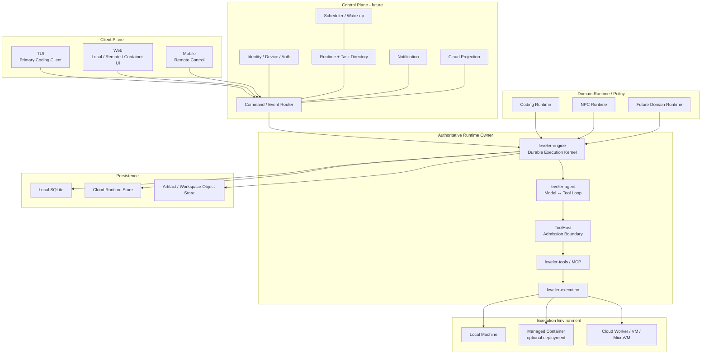
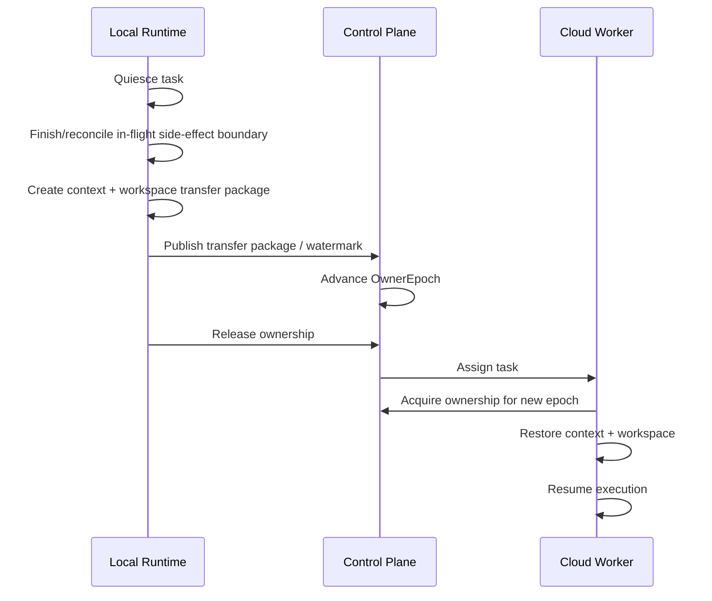

# CodeLeveler Future Runtime Architecture

> Status: Target Architecture  
> Scope: Long-term product and runtime direction  
> Current implementation reference: `docs/ARCHITECTURE.md`  
> Principle: this document describes the **target state**. A capability described here must not be presented as implemented until the code and acceptance gates exist.

## 1. Product definition

CodeLeveler should evolve from a reliable local Coding Agent into a **Durable Agent Runtime**.

The long-term user model is not “stay in front of one terminal while the agent works”. The user submits a goal to a runtime, the runtime keeps executing independently of a particular client, and the user may observe or control the same task from TUI, Web, or Mobile.

The long-term definition is:

> **CodeLeveler is a durable agent runtime that lets AI agents safely execute long-running work in real environments, locally or in the cloud, while users can observe and control the same task from multiple clients.**

Coding is the first and primary product domain. NPC / long-running autonomous agents are the second major domain.

CodeLeveler may also be deployed inside a managed container for another product, such as an online programming environment. That is a **possible deployment form of the same runtime**, not a separate product line and not a reason to build a second agent core.

AgentGate is intentionally outside this architecture. A model gateway may be used externally, but CodeLeveler must not depend on AgentGate as part of its Runtime Core.

The runtime is not a generic chatbot framework. Its differentiators are durable execution, safe side effects, recoverability, multi-client control, explicit ownership, and evidence-backed completion.

---

## 2. Non-negotiable product principles

1. **TUI remains the primary Coding interface.**
2. **Task lifetime is independent from client lifetime.** Closing TUI, Web, or Mobile does not cancel accepted work.
3. **Web and Mobile are first-class clients**, not alternate implementations of the agent.
4. **One Task has exactly one authoritative Runtime Owner at any point in time.**
5. **Commands go to the owner; canonical events come from the owner.**
6. **Local and cloud databases do not use naive bidirectional table synchronization.**
7. **Agent decisions cannot bypass ToolHost, permission, sandbox, cancellation, or durable side-effect barriers.**
8. **The model cannot promote its own work to verified completion.**
9. **Coding, NPC, local execution, cloud execution, and possible container deployment reuse the same Runtime Core.**
10. **NPC does not create a second agent loop, permission system, event model, or recovery model.**
11. **Scheduler belongs to Runtime / Control Plane infrastructure, not to NPC.**
12. **Cloud execution uses isolated workers.**
13. **Ownership transfer is explicit, quiesced, fenced, and recoverable.**
14. **Client state is a projection. Runtime facts come from canonical state and events.**
15. **Architecture and core stability come before product breadth.** Cloud, Scheduler, NPC, and other product surfaces must not drive premature core rewrites.

---

## 3. Primary scenarios

### 3.1 Local Coding with remote handoff

TUI remains the normal development path:

```text
Developer
   │
   ▼
TUI
   │
   ▼
Local Runtime
   │
   ├── inspect repository
   ├── edit files
   ├── run commands
   ├── verify
   └── repair
```

The developer may leave the computer while the task is running:

```text
TUI disconnects
      │
      ├──X── task cancelled
      │
      ▼
Local Runtime continues
      │
      ├── Web reconnects
      └── Mobile reconnects
```

Web or Mobile must eventually be able to observe or control the same task:

- current status;
- conversation;
- tool activity;
- plan;
- diff;
- verification;
- approvals;
- clarification questions;
- steering;
- cancel / resume;
- completion evidence.

The architectural rule is:

> **Task belongs to Runtime, not to TUI/Web/Mobile.**

### 3.2 Mobile-created local Coding task

A user away from the computer may create work on an online development machine:

```text
Mobile
  │
  ▼
Select host
  │
  ▼
Select project
  │
  ▼
Create task
  │
  ▼
Owner = Local Runtime
```

The phone is a client. It does not execute the model, tools, repository operations, or verification.

### 3.3 Cloud Coding

A task may explicitly run in the cloud:

```text
Create Task
   │
   ├── Local
   ├── Cloud
   └── Auto (future policy)
```

Cloud execution means the user's development machine may be completely offline:

```text
TUI / Web / Mobile
        │
        ▼
Control Plane
        │
        ▼
Cloud Worker
        │
        ├── provision isolated workspace
        ├── obtain scoped credentials
        ├── clone / restore repository
        ├── run CodeLeveler Runtime
        ├── verify
        └── publish result
```

### 3.4 NPC / long-running autonomous work

NPC is a long-lived domain runtime above the same execution kernel.

Example:

```text
User before sleep:
"Check recent failing tests, fix what can be fixed,
and prepare a report for the rest."
        │
        ▼
NPC Inbox / Goal
        │
        ▼
Scheduler / Wake-up
        │
        ▼
NPC policy chooses work
        │
        ▼
Task Runtime
        │
        ▼
Cloud Worker
```

The user can later receive a Mobile notification, inspect progress, answer a question, approve a risky operation, or review the final evidence.

### 3.5 Possible container deployment in another product

A future product may run CodeLeveler inside an isolated container, for example an online programming product:

```text
Online Programming Product
        │
        ▼
Managed Container
        │
        ├── repository / workspace
        └── CodeLeveler Runtime
              │
              ├── Engine
              ├── Agent Loop
              ├── ToolHost
              ├── Tools
              ├── Execution
              └── Verification
```

This scenario does **not** currently require a new `Runtime SDK` product or a separate embedded architecture.

The preferred reuse path is the same interface family CodeLeveler already needs for itself:

```text
TUI / Web / Client Protocol
            │
            ▼
      CodeLeveler Runtime
```

For an online programming product, Web is likely the main user-facing surface; TUI may also be exposed inside the remote/container development environment.

If a future real integration proves that the existing client/runtime protocol is insufficient, a dedicated SDK/API may be extracted then. It is not a current architectural prerequisite.

---

## 4. Deployment forms

The core should support multiple execution environments without becoming multiple runtimes.

| Deployment | Owner location | Typical client | Storage | Importance |
| --- | --- | --- | --- | --- |
| Local Runtime | User machine | TUI / local Web / remote Mobile | SQLite | Primary current direction |
| Cloud Worker Runtime | Cloud isolated worker | Web / Mobile / TUI remote view | Cloud store + object storage | Major future direction |
| Container-hosted Runtime | Product-managed container | Primarily Web / TUI | Usually local/container storage or host-provided persistence | Possible future integration |
| NPC tasks | Usually Cloud Runtime | Mobile / Web | Cloud store | Major future domain |

Container hosting is a deployment option, not a separate Runtime Core.

---

## 5. Target system architecture



For purely local or container-hosted use, the Control Plane is optional. Clients may connect directly through local/runtime transport.

---

## 6. Runtime Core boundary

`leveler-engine` should converge on the role of **Durable Agent Execution Kernel**.

It owns generic runtime semantics:

- task lifecycle;
- turn lifecycle;
- canonical event ordering;
- terminal state commitment;
- cancellation;
- supervision;
- persistence protocol;
- snapshot/resume;
- crash reconciliation;
- interaction waiting;
- ownership/fencing validation;
- typed stop reasons;
- hard runtime limits.

It must not require Coding-specific concepts such as:

- Cargo;
- Git-specific verification strategy;
- repository-specific task phases;
- LSP;
- NPC identity;
- NPC personality;
- NPC world state;
- UI concerns.

The current implementation should remain Coding-first during migration. The target boundary is generic, but that is not a reason to prematurely remove working Coding behavior.

---

## 7. Agent Loop boundary

`leveler-agent` remains the direct model-tool-result loop:

```text
Context
  │
  ▼
Model Request
  │
  ▼
Model Response
  │
  ▼
Tool Proposal
  │
  ▼
ToolHost
  │
  ▼
Tool Result
  │
  └──────────> next context
```

The Agent may:

- construct model requests;
- consume model events;
- manage context and compaction;
- propose tools;
- receive tool results;
- request continuation/delegation through host-provided policy.

The Agent must not:

- directly execute side effects;
- decide its own durable permission;
- directly mutate runtime lifecycle state;
- acquire task ownership;
- bypass cancellation;
- mark itself `Verified`.

---

## 8. ToolHost and execution safety

ToolHost is the single admission path from model-proposed action to real execution:

```text
Tool proposal
     │
     ▼
Schema validation
     │
     ▼
Risk classification
     │
     ▼
Hooks / policy
     │
     ▼
Permission / approval
     │
     ▼
Durable side-effect barrier
     │
     ▼
Execution
     │
     ▼
Durable finish record
```

All domains and execution environments reuse this boundary:

- local Coding;
- cloud Coding;
- container-hosted Coding;
- child agents;
- NPC-triggered work.

There must not be separate `NpcToolExecutor`, `CloudToolExecutor`, or `ContainerToolExecutor` paths that bypass the same safety contract.

---

## 9. Task and Session must become distinct concepts

The current product naturally grew around Session as the unit of work. The target runtime requires an explicit distinction.

### Task

A Task is a durable unit of work with an execution lifecycle.

Conceptually:

```text
Task
 ├── TaskId
 ├── Goal / Contract
 ├── Domain
 ├── ExecutionTarget
 ├── RuntimeOwner
 ├── OwnerEpoch
 ├── LifecycleStatus
 ├── Policy
 ├── Evidence
 ├── Result
 └── PrimarySessionId / Sessions
```

### Session

A Session is the human/agent interaction history and UI attachment point.

```text
Session
 ├── Messages
 ├── Client-visible state
 ├── Pending interactions projection
 └── Task association
```

The migration must be gradual. Existing sessions cannot be invalidated merely to produce a cleaner target model.

---

## 10. Generic lifecycle vs domain workflow

Runtime lifecycle should be coarse and domain-neutral:

```text
Created
Queued
Assigned
Running
WaitingInteraction
Suspended
Blocked
Completed
Failed
Cancelled
```

Coding-specific workflow can retain richer states such as:

```text
Understand
Localize
Plan
Implement
Verify
Repair
Review
```

NPC may have a different domain state model.

The invariant is:

> Domain workflow may refine execution, but it cannot redefine ownership, persistence, side-effect safety, cancellation, or terminal runtime semantics.

---

## 11. Single Authoritative Runtime Owner

The most important distributed-runtime invariant is:

> **Each Task has exactly one authoritative Runtime Owner at any point in time.**

Conceptually:

```text
TaskId
RuntimeId
OwnerEpoch
ExecutionLocation
Lease / heartbeat metadata
```

`OwnerEpoch` acts as a fencing token. When ownership changes, the epoch advances. A stale runtime reconnecting after a partition must not append canonical events, resolve approvals, or complete the task under an older epoch.

This prevents split brain and duplicate side effects.

---

## 12. Commands and events

### Commands

```text
TUI / Web / Mobile
        │
        ▼
     Router
        │
        ▼
Authoritative Runtime Owner
```

Typical commands:

- CreateTask;
- SubmitMessage;
- RunGoal;
- Steer;
- ApprovalDecision;
- AnswerClarification;
- Cancel;
- Pause / Resume;
- RequestDiff;
- TransferTask;
- ScheduleTask.

### Events

```text
Authoritative Runtime Owner
        │
        ▼
Canonical Event Stream
        │
        ├── TUI
        ├── Web
        ├── Mobile
        └── Cloud Projection
```

Canonical events must be:

- sequenced;
- versioned;
- durable when they describe runtime facts;
- attributable;
- replayable for recovery/projection;
- ownership/fencing aware in distributed mode.

Display-only streaming deltas may remain transient.

---

## 13. Storage architecture

### Local Runtime

SQLite remains an appropriate local source of truth for:

- task/session metadata;
- turns;
- messages;
- canonical events;
- command receipts;
- context snapshots;
- verification records;
- artifact metadata.

### Container-hosted Runtime

A container may use the same local storage model when the container runtime is authoritative. If a future host product needs stronger centralized durability, that requirement should be satisfied through the same storage ports introduced for Runtime generalization, not by creating a new agent implementation.

### Cloud Runtime

Cloud execution should use a cloud-capable transactional store behind the same logical storage contracts. PostgreSQL is the expected candidate, but the architecture should depend on semantics rather than a database brand.

Large payloads belong in object storage when appropriate:

- workspace packages;
- large logs;
- attachments;
- artifact bodies;
- diff bundles;
- large snapshots.

---

## 14. Local and cloud data interoperability

Local SQLite and cloud storage are **semantically interoperable**, not directly bidirectionally synchronized at the table level.

```text
Local Task
   └── Local Runtime + SQLite = authoritative

Cloud Task
   └── Cloud Runtime Store = authoritative
```

The cloud may maintain a projection of a local task for Web/Mobile display and notification, but that projection is not an execution writer.

User actions travel as Commands to the authoritative Runtime Owner. They are not applied by updating a projection row and later merging databases.

---

## 15. Ownership transfer: Local to Cloud

A future `Continue in Cloud` feature is an ownership transfer, not a database merge.



A task with an unreconciled `ToolCallStarted` and no matching finish cannot transfer ownership until recovery determines whether the side effect ran.

---

## 16. Local Runtime / daemon target

The local runtime must become a durable service independent of TUI lifetime.

Target relationship:

```text
TUI / Web
    │
    ▼
Local Runtime Service
```

The local runtime/supervisor is responsible for:

- runtime identity;
- process lifecycle;
- health;
- per-project runtime availability;
- restart/recovery;
- task admission capacity;
- remote attachment;
- optional registration with Control Plane.

An in-process mode may remain for development, tests, debugging, or fallback, but must not define product lifecycle semantics.

---

## 17. Control Plane

Control Plane coordinates multiple runtimes and clients. It is not the Agent Runtime itself.

Responsibilities:

- identity and devices;
- runtime directory;
- task directory;
- command routing;
- event projection;
- notifications;
- scheduler/wake-up infrastructure.

It must not directly execute model-proposed tools or become a hidden second writer of Task facts.

---

## 18. Cloud Worker

Cloud Worker is another deployment of the same Runtime Core:

```text
Cloud Worker
   │
   ├── leveler-engine
   ├── leveler-agent
   ├── ToolHost
   ├── leveler-tools
   └── leveler-execution
```

Cloud-specific differences belong to environment adapters and infrastructure:

- isolated workspace provisioning;
- credential brokering;
- network policy;
- CPU/memory/disk quotas;
- process cleanup;
- cloud storage;
- worker lease / ownership;
- environment image selection.

---

## 19. Coding Runtime

Coding is a domain runtime layered above the generic execution kernel.

Coding-specific concerns include:

- Repository / workspace;
- Git base and diff;
- project rules;
- LSP;
- language/toolchain discovery;
- Coding plan/evidence;
- verification plan;
- build/test/format;
- Coding completion policy.

The generic Runtime Core should not absorb these concepts simply because Coding is the first product.

---

## 20. Completion and evidence

Completion remains host-controlled:

```text
Model:
"I think the work is done"
        │
        ▼
Domain Completion Gate
        │
        ├── evidence
        ├── scope checks
        ├── build/test/format when applicable
        └── policy
        │
        ▼
Engine commits terminal outcome
```

For Coding, `Verified` is stronger than a model completion statement.

For NPC and future domains, completion policy may differ, but the model still does not write its own authoritative terminal status.

---

## 21. NPC Runtime

NPC is a domain runtime that adds long-lived identity and context.

NPC owns concepts such as:

```text
NpcIdentity
LongTermMemory
Inbox
WorldState
RelationshipState
CharacterPolicy
GoalSelection
ScheduleDefinition
```

NPC does not own:

- ToolHost;
- sandbox;
- approval;
- task persistence;
- crash recovery;
- canonical event semantics;
- provider execution;
- cloud worker safety.

Those remain shared Runtime Core responsibilities.

---

## 22. Scheduler and wake-up

Scheduler is Runtime / Control Plane infrastructure.

Possible triggers:

```text
Manual
At(time)
Recurring schedule
Inbox message
External event
Task completed
Dependency changed
Retry deadline
```

Scheduler does not run the Agent Loop itself. It creates or wakes durable work which is then executed by a Runtime Owner.

---

## 23. Multi-agent

The preferred model remains a main agent with dynamic delegated children rather than a permanently fixed Planner/Coder/Tester/Reviewer topology.

All delegated agents:

- execute through the same ToolHost;
- share the same task ownership boundary;
- produce attributable events;
- obey the same permission and cancellation semantics;
- cannot create a hidden secondary runtime lifecycle.

---

## 24. Client model

### TUI

TUI is the most capable Coding client:

- full conversation;
- plans;
- tool activity;
- code/diff;
- verification;
- sub-agents;
- approvals;
- steering;
- task/session controls.

### Local Web

Local Web remains a browser client over the same local runtime contract.

### Remote Web

Remote Web should connect through future Control Plane / remote runtime routing. It must not be implemented by exposing the local Web server directly to the public internet.

### Mobile

Mobile optimizes for remote control:

- task list;
- status;
- conversation;
- approvals;
- clarification;
- steering;
- cancel;
- notifications;
- diff / verification / evidence views.

### Container-hosted use

When CodeLeveler is used inside another online programming product, the expected UI reuse is still primarily **Web and/or TUI**. A new SDK is optional and should only be introduced if real integration requirements prove necessary.

---

## 25. Reconnect and offline semantics

If a client disconnects, execution continues.

Reconnect uses:

```text
subscribe
   │
   ▼
snapshot + watermark
   │
   ▼
events after watermark
```

If a Local Runtime becomes offline, cloud projections must display owner offline / last known state. They must not pretend execution is continuing.

If event continuity cannot be proven, the client must resync from canonical state rather than guess missing events.

---

## 26. Security model

### Local

- workspace boundary;
- path validation;
- sandbox;
- process-tree control;
- permission profiles;
- explicit approvals;
- secrets redaction;
- authenticated local transports where applicable.

### Remote control

- device identity;
- pairing;
- revocation;
- signed commands;
- runtime-authenticated responses;
- remote capability allowlist;
- stricter remote approval rules;
- no direct public exposure of the local Web runtime.

### Container hosting

The host product is responsible for isolation around the container while CodeLeveler remains responsible for in-runtime execution safety. This scenario must reuse the same ToolHost and execution policy.

### Cloud

Cloud additionally requires:

- worker identity;
- tenant isolation;
- ownership fencing;
- encrypted transport;
- credential broker;
- at-rest protection;
- isolated execution environment;
- resource quotas;
- auditable worker actions.

---

## 27. Model/provider boundary

CodeLeveler Runtime remains independent from a specific provider or gateway.

External model gateways, including AgentGate, may be configured like any other compatible provider route, but they are not part of CodeLeveler Runtime architecture.

Runtime-level semantics remain:

- messages;
- model events;
- tool proposals;
- stop semantics;
- context management;
- execution policy.

Provider/gateway concerns remain outside:

- endpoint selection;
- authorization;
- vendor wire quirks;
- provider failover/routing implementation.

---

## 28. Extension model

The architecture may support independent extensions for:

- providers / model protocols;
- tools;
- MCP;
- domain policies;
- verification/completion policies;
- context providers;
- storage adapters;
- transports;
- worker environment adapters.

An extension never gains the right to bypass Runtime Core invariants.

---

## 29. Non-goals

The target architecture explicitly rejects:

- SQLite/PostgreSQL table-level bidirectional synchronization;
- client-side authoritative task state machines;
- Web/Mobile/NPC-specific agent loops;
- a separate cloud or container Tool executor bypassing ToolHost;
- Relay becoming an execution engine;
- AgentGate becoming part of the CodeLeveler core architecture;
- last-write-wins conflict resolution for runtime ownership;
- terminal process lifetime as a requirement for Task survival;
- exposing local Web directly to the public internet as remote architecture;
- building a Runtime SDK before a real integration requires it;
- premature universal workflow DSLs;
- fixed multi-agent role graphs as a core requirement;
- abstracting every Coding concept before a second real domain proves the shared abstraction.

---

## 30. Target user experience

The user should eventually see Tasks, not process topology:

```text
Tasks

Fix login regression
Running · MacBook

Upgrade database client
Running · Cloud

Dependency audit
Completed · NPC

Security migration
Waiting Approval · Cloud
```

A container-hosted integration may expose the same CodeLeveler Web/TUI experience inside another product, but this is optional and should not distort the primary runtime roadmap.

---

## 31. Final architecture statement

```text
Clients
  ├── TUI
  ├── Web
  └── Mobile
        │
        ▼
Command / Event Contract
        │
        ▼
Authoritative Runtime Owner
        │
        ├── Generic Engine
        ├── Agent Loop
        ├── ToolHost
        ├── Tools
        └── Execution
        │
        ├── Local Machine
        ├── Cloud Worker
        └── Managed Container (optional deployment)
        │
        ▼
Domain Runtime
        ├── Coding
        ├── NPC
        └── Future domains
```

The strategic rule is:

> **First make one durable, recoverable, safely executable Runtime Core stable. Then build Cloud, NPC, and other product capabilities on top of that core without forking it.**
