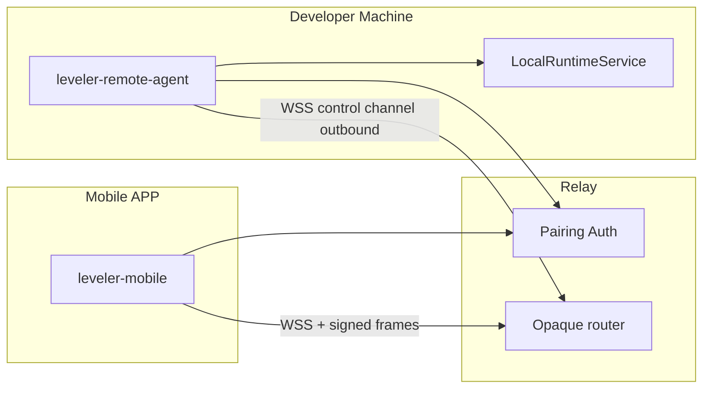
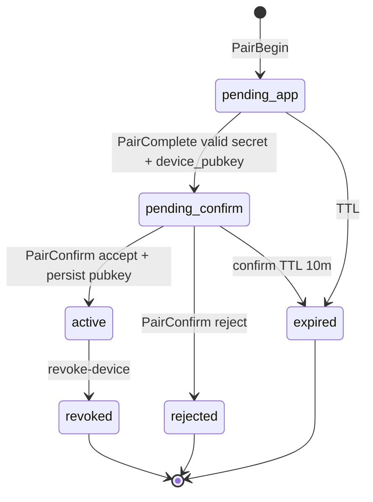
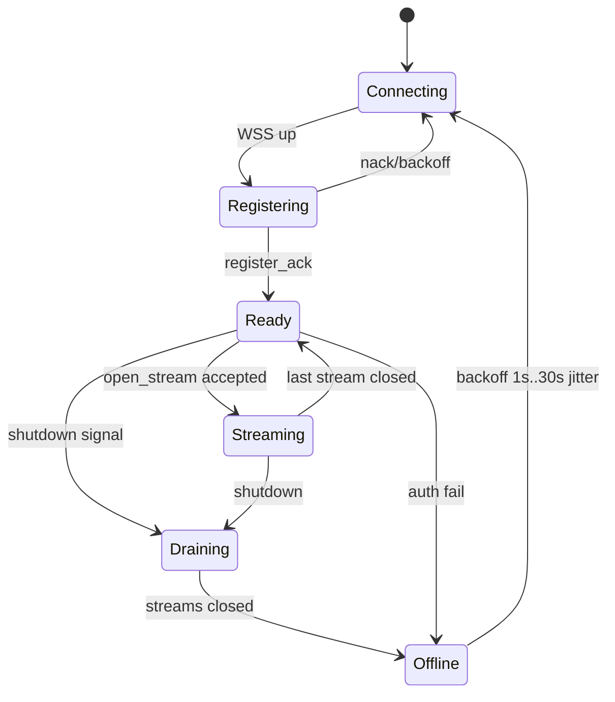
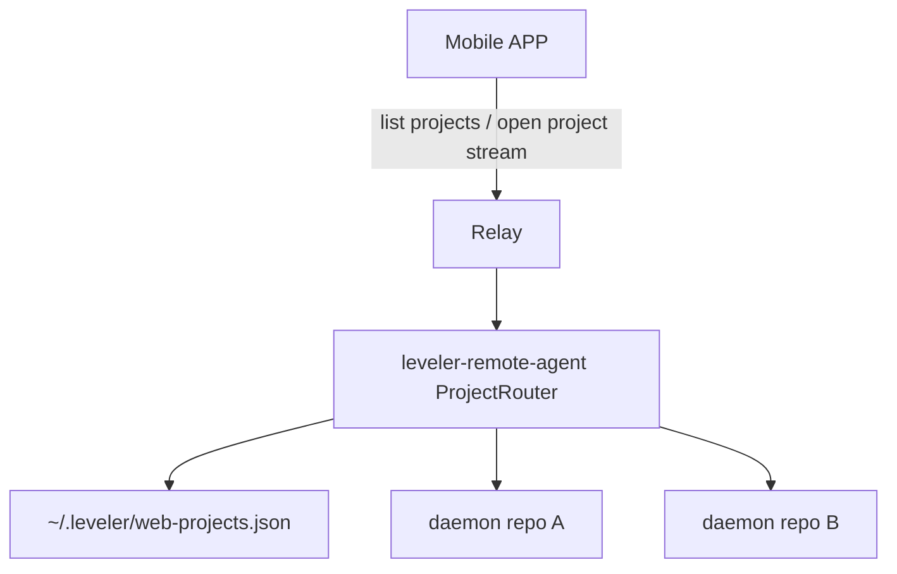

# 真远程控制：独立移动 APP 控制 CodeLeveler

| 字段 | 值 |
| --- | --- |
| **Title** | True remote control for independent mobile APP (CodeLeveler) |
| **Author** | TBD |
| **Date** | 2026-07-25 |
| **Status** | Draft (rev. 6 — 签名绑定收件方（audience）、canonical 字段收紧、时钟窗统一 ±120s) |
| **Related** | `docs/ARCHITECTURE.md`, `docs/STABILITY.md`, `leveler-client-protocol`, `leveler-local-transport`, `leveler-web` |
| **Cross-link** | 远程设计 **永不** 修改 `leveler-web` 的 loopback 硬约束；见 `crates/leveler-web/README.md` 与 `server.rs` `bind` / `bind_multi` |
| **Scope** | **本设计完整范围** = monorepo（wire / agent / relay / CLI）**+ 独立移动 APP（leveler-mobile）**；APP 不是「后期外挂说明」，而是 Phase 1 垂直切片与验收的一部分 |

---

## Overview

用户需要的是**真远程**——独立手机 APP 在家/办公室局域网外，也能配对并操控开发机上的 CodeLeveler 会话：提交目标与消息、流式接收助手输出、处理审批/澄清、取消 turn、**切换多个已打开项目**、列出会话、查看状态。这与「隧道 + 手机浏览器打开 loopback WebUI」不同：产品要有正式的身份、配对、能力边界、**移动端 UX** 与威胁模型，而不是把本机 daemon 端口暴露到公网。

本设计在**不改 `leveler-web` 仅 loopback 绑定**、**不平行发明一套命令模型**的前提下，交付整条产品链：

1. **本机**：`leveler-remote-agent`（含 ProjectRouter）出站连 relay  
2. **边缘**：self-host relay（配对 / 路由）  
3. **手机**：**leveler-mobile**（iOS + Android）作为正式客户端  

会话数据面复用现有 `ClientCommand` / `RuntimeEvent` / `UiSessionSnapshot`；WS framing 抽取到可共享 crate；APP 通过 **OpenAPI / JSON Schema + golden 向量** 与 Rust 侧契约对齐（不链 Rust 进手机）。

**Relay 信任（修订后硬约束）：**

- Phase 1 **强制** device↔runtime **端到端完整性**（对会话帧 **与** APP 可见的 create/snapshot/attachment 响应签名/验签）：relay **不能伪造** `ClientCommand` 或篡改安全关键状态。
- **设备公钥 TOFU：** 本机确认时展示并固化 `device_pubkey` 指纹；agent **只**信任 accept 时写入 `~/.leveler/remote/devices.json` 的公钥，**不**在后续从 relay 静默更新密钥。
- Phase 1 **机密性**默认路径 = **self-host relay（Option B）**；官方托管 relay 若上线，文档必须标明「TLS 终止后 relay 可窥读明文 UI 流量，直到 Phase 2 AEAD」。
- Session token 只授权**路由通道**，不能单独作为命令权威。

---

## Background & Motivation

### 当前状态（仓库事实）

| 组件 | 路径 / 要点 | 信任模型 |
| --- | --- | --- |
| 稳定消息契约 | `crates/leveler-client-protocol`：`ClientCommand`、`RuntimeEvent`、`UiSessionSnapshot`、`CommandEnvelope`、`ProtocolEnvelope`（`PROTOCOL_VERSION` **1.3**）、`InteractiveRuntimeClient` | UI 与 runtime 的唯一**语义**契约；注释已预留 cloud transport 校验 envelope |
| 会话 WS framing | **今日**仅在 `crates/leveler-web/src/protocol.rs`（`UpstreamMessage` / `DownstreamMessage` + golden fixtures） | **尚未**进入 client-protocol；remote **不得**依赖 `leveler-web` 整 crate（会拖入 SPA/axum）——必须先抽取（PR0） |
| 本地传输 | `crates/leveler-local-transport`：`LocalRuntimeService`、`CreateSessionRequest` / `SessionBootstrap`；Unix `0600`；TCP `Handshake { token }`；frame ≤ **64 MiB**；socket 客户端 **拒 `Quit`** | **本地信任**；token 经 `LEVELER_DAEMON_TOKEN`，不进 argv |
| 浏览器 UI | `leveler-web`：REST + WS；`bind` **拒非 loopback**；每进程 256-bit bearer、constant-time、不落盘 | 跨机 = TLS 隧道到 loopback，**禁止**公网 bind |
| 幂等投递 | `CommandEnvelope`；运行时持久化靠 **`leveler-storage::CommandReceiptRepository`**（`CommandReceipts` 仅为进程内辅助类型） | 远程 agent **不得**自建第二套 receipt 库；一律 `deliver_protocol` |
| 数据分级 | `EngineEvent::data_class` / `public_projection`（**不是** `RuntimeEvent`） | 低信任投影 vs 交互 UI 协议分离 |
| 审批 | `leveler-app` 内存 `PendingApprovals` + engine event log；`ApproveAlways` 可写 project `permissions.yaml`（`leveler-agent` dispatch） | 远程必须在入口挡 `ApproveAlways`，并引入 origin |
| CLI | `serve` / `web` | `STABILITY.md` **Provisional**；D3 开放 |
| Windows | `README.zh-CN.md` + transport stub | **无** Unix daemon transport；远程 MVP 先 macOS/Linux |
| `remote_readiness.rs` | `leveler-engine/tests` | 保护 event-log 属性；**文件自评**「不宣称生产远程就绪」——不得当作完整远程审批 UX 证明 |

### 痛点

1. 隧道 + 浏览器不是产品远程：无设备身份、无撤销、无 allowlist、无正式版本协商。
2. 公网 bind web/daemon = 远程 RCE 网关。
3. 交互 APP 需要 UI 级 stream；`public_projection` 不能替代 chat，但 relay 又不能成为可伪造命令的控制代理。

---

## Goals & Non-Goals

### Goals

1. NAT 外独立 APP 控制**用户自有机器**上的 runtime。
2. 配对后：list/open/create session、`deliver`、订阅、snapshot/resync、approval/clarification、cancel。
3. 复用 client-protocol **语义**；session framing 共享 crate，不复制方言。
4. **完整性默认**：relay 无法伪造命令；**机密性**：MVP 以 self-host 为隐私路径；Phase 2 AEAD。
5. 远程 allowlist + 更严审批（含 deny-on-timeout、禁远程 `ApproveAlways`）。
6. major 协商；滞后 → `resync_required`。
7. MVP：单用户、macOS/Linux host；**一个 APP 可切换本机多个「已打开项目」**（见 K14）。
8. **交付可用的 leveler-mobile**（iOS + Android 至少 TestFlight / 内测包）：配对、项目切换、对话、审批闭环。
9. 与 `serve`/`web` 共存；Provisional 毕业路径 + golden fixtures（Rust + APP 契约测试）。

### Non-Goals

| 非目标 | 说明 |
| --- | --- |
| 多租户 SaaS agent farm / 云端跑工具 | 工具只在用户机 |
| 改 `leveler-web` 非 loopback | 硬约束 |
| Day-1 TUI / Web 全量 parity | 无完整文件树、无 LSP、无复杂 multi-agent 可视化（可后补） |
| Windows daemon 阻塞 MVP | 随后接入 |
| Relay 持久命令队列 / transcript | 禁止（第二真相源 + 安全风险） |
| 隧道+浏览器冒充产品远程 | 仅逃生舱 |
| 依赖 `leveler-web` 的 remote-agent | 禁止 |
| APP 内嵌 LLM / 本机改代码 | 执行永远在开发机 |
| 上架商店作为 Phase 1 门禁 | 内测分发即可；商店合规另轨 |

---

## Proposed Design

### Architecture options

| 方案 | 描述 | NAT | 完整性 | 机密性（对中间人） | 运维 | 评价 |
| --- | --- | --- | --- | --- | --- | --- |
| **A. 反向隧道 + relay** | agent 出站；APP 连 relay | 强 | **Phase 1 强制 E2E 签名** | TLS 到 relay；托管时可窥读 | 需 relay | **部署默认** |
| **B. 自建 gateway** | 同 A wire，用户 VPS | 强 | 同 A | 用户信自己的 relay | 用户运维 | **MVP 隐私默认与推荐** |
| **C. P2P** | 打洞 | 中 | 易 E2E | 优 | 难 | Phase 2+ |
| **D. 隧道 + loopback web** | 用户网络产品 | 依赖用户 | 无产品身份 | 取决于隧道 | 低 | 非产品主路径 |

**部署默认：** 协议形态 A/B 同构（仅 `relay_url`）。  
**隐私默认（Q1 临时默认）：** 文档、CLI 与 docker-compose **优先 self-host（B）**；官方多租户 relay **非** Phase 1 交付前提。  
**完整性（Q3 已决）：** 见 K11——任何路径（含 self-host）Phase 1 均要求 device/runtime 签名帧；托管额外要求 Phase 2 前在 UX 披露「可窥读」。



### Components

| 组件 | 形态 | 职责 |
| --- | --- | --- |
| **`leveler-session-wire`**（新，或并入 `leveler-client-protocol` 的 `wire` 模块） | monorepo 库 | `UpstreamMessage` / `DownstreamMessage`、可选 `Ping` 扩展、**session golden fixtures**；**无** axum/SPA |
| **`leveler-remote-protocol`** | monorepo 库 | 配对/auth/agent 隧道控制帧/错误码；**不**重定义 `CreateSessionRequest`（从 `leveler-local-transport` re-export 或 APP 侧只消费 JSON schema） |
| **`leveler-remote-agent`** | monorepo + CLI | 出站 tunnel；验签；allowlist；`ClientOrigin`；映射到 `LocalRuntimeService` |
| **Relay** | `services/leveler-relay` 或外置 | 配对、目录、签 **routing** token、多路复用转发 **不验业务语义**（可浅查 type）；不执行工具、不存 transcript |
| **leveler-mobile** | **产品范围（本设计内）**；代码仓：`apps/leveler-mobile`（monorepo 子目录）或同组织独立 repo，见 K22 | 配对、host/项目切换、会话 UI、签验、中文、安全存储 |
| **`leveler remote …`** | `leveler-cli` | enable / pair / confirm / open / projects / revoke / status |
| **`leveler-web` / `serve`** | 不变 | loopback；agent **本地**连 Unix socket 或 `127.0.0.1` TCP |
| **契约伪像** | monorepo `schemas/` + CI | JSON Schema / OpenAPI + 签名 golden；**APP CI 消费同一伪像** |

依赖：

```text
leveler-web ─────────┐
leveler-remote-agent ┼──▶ leveler-session-wire ──▶ leveler-client-protocol
                     └──▶ leveler-local-transport ──▶ leveler-client-protocol
leveler-remote-protocol ──▶ (serde DTOs only; optional re-export CreateSessionRequest schema)
relay ──▶ leveler-remote-protocol + leveler-session-wire (types only)

leveler-mobile ──▶ (HTTP/WSS) relay
leveler-mobile ──▶ schemas/*.json + golden vectors（codegen 或手写 client，禁止第二方言）
```

**禁止：** `leveler-remote-agent` → `leveler-web`；foundation → remote；APP 私自定义未版本化的命令枚举。

### 进程模型（sidecar vs 内嵌）

| 模式 | 说明 | 取舍 |
| --- | --- | --- |
| **Sidecar（MVP 默认）** | 独立 `leveler remote-agent` 进程，连本机 `serve` socket/TCP | 故障隔离；lifecycle 清晰；与 TUI/web 同为 `LocalRuntimeService` 多订阅者 |
| **`serve --remote` flag（Phase 2 可选）** | daemon 内嵌 connector | 少一进程；升级/崩溃耦合；实现可后置 |

**SQLite / 多客户端：** 现有模型已支持多 UI 订阅同一 runtime（broadcast events）。`create_session` 可并发；无全局单写锁假设外的特殊限制。远程、TUI、web **同时 attach 合法**。若两处同时 `ApprovalDecision`，以 runtime 侧先到为准，后到得 `error`（见审批竞态）。

**其他被问到的替代：**

| 替代 | 结论 |
| --- | --- |
| 仅 Tailscale + 产品配对叠 loopback web | 无独立 APP 控制面；可作文档「高级逃生」；非主路径 |
| 产品运营 SSH reverse tunnel | 运维与密钥分发重；不如 WSS agent 通道统一 |
| 第二进程 vs 内嵌 | MVP sidecar；见上 |

### End-to-end 会话流（修订）

```mermaid
sequenceDiagram
  participant App as Mobile APP
  participant Relay as Relay
  participant Agent as remote-agent
  participant RT as LocalRuntimeService

  Agent->>Relay: WSS /v1/agent/tunnel (runtime mTLS or signed register)
  Agent->>Relay: AgentToRelay::Register / Heartbeat
  App->>Relay: POST /v1/pair/complete (device_pubkey + secret)
  Relay-->>Agent: pairing_pending {device_pubkey, name, …}
  Note over Agent: CLI shows fingerprint; user accepts
  Agent->>Agent: persist devices.json TOFU
  Agent->>Relay: pair_confirm accept
  App->>Relay: POST /v1/auth/session (device-signed assertion)
  Relay-->>App: access_token + refresh_token (routing only)
  App->>Relay: WSS /v1/runtimes/{id}/session
  Relay->>Agent: open_stream {stream_id, device_id}
  Agent->>Agent: lookup pubkey from devices.json only
  Agent-->>Relay: stream_accepted
  App->>Relay: SignedEnvelope session_upstream
  Relay->>Agent: forward_upstream (opaque)
  Agent->>Agent: verify device sig (TOFU key) + allowlist
  Agent->>RT: deliver_protocol
  RT-->>Agent: events
  Agent-->>Relay: forward_downstream SignedEnvelope
  Relay-->>App: forward_downstream (opaque)
  App->>App: verify with QR runtime_pubkey
  App->>Relay: signed rpc create_session
  Agent-->>App: SignedEnvelope rpc_response SessionBootstrap
```

---

## Identity & pairing flow

### 身份模型

| 实体 | 标识 | 密钥 | 存储 |
| --- | --- | --- | --- |
| Device | `device_id` | Ed25519 密钥对（APP 安全区） | APP 私钥；**agent 本机**在 accept 时固化公钥；relay 可存公钥副本（**非** agent 信任源） |
| Runtime | `runtime_id` | Ed25519 密钥对 | `~/.leveler/remote/runtime_key`；**QR 含 runtime_pubkey** 供 APP 锚定 |
| Pairing | `pairing_id` | 见熵要求 | relay 短 TTL |
| Routing session | `sid` / `jti` | access + refresh | 不落盘长期 secret |

MVP **device-only**（无用户账号）——**临时默认**，可逆（Q2）。

### 配对码熵

| 材料 | 规范 |
| --- | --- |
| **QR 内 secret** | ≥ **128 bit** 密码学随机（base64url 或 hex），**唯一**可完成配对的秘密 |
| **QR 内 runtime 锚定** | `runtime_id` + `runtime_pubkey`（raw 32-byte Ed25519，base64url）+ `relay_url` + `pairing_secret` |
| **无展示短码** | 不提供口述短码：无法扫码时在 APP **粘贴完整 QR payload**；短码既不能完成配对也不是指纹，删除以免误用 |
| **TTL** | 5 分钟；一次性 |
| **速率限制** | `/pair/complete`：每 IP 10/min；每 runtime 20 失败/小时后锁定 15 min |
| **本机确认** | **强制**；须展示 **device 公钥指纹**（见 TOFU）；未 `PairConfirm accept` 前不得 `active` |

### 设备公钥 TOFU（安全关键 — 堵 relay 换钥）

> 首轮本机 **accept 是安全关键操作**：用户确认的是「这台手机的公钥」，不是仅设备昵称。若只确认 name，被入侵的 relay 可替换 `device_pubkey`，用户仍点接受，从而伪造全部 `SignedSessionFrame` upstream——K11 完整性会失效。

| 步骤 | 规范 |
| --- | --- |
| 1. APP `pair/complete` | 提交 `device_id`, **`device_pubkey`**（Ed25519 raw 32B base64url）, `device_name`, `platform`, `pairing_secret`, 可选 `scope` |
| 2. Relay → agent `pairing_pending` | **必须**含 `device_pubkey`（及 name/platform/scope/pairing_id）；relay **不得**在后续静默改写该字段而不重新走 pending |
| 3. CLI/TUI 确认 UI | 显示：`device_name`、`platform`、`scope`、**指纹** `SHA-256(device_pubkey_raw)[0..8]` 的 **16 hex 小写**（空格分组 `abcd efgh …`）；文案标明「请与手机上显示的指纹一致」 |
| 4. APP 确认 UI | 配对流程中显示 **同一算法** 的本机公钥指纹，便于用户对照 |
| 5. Accept | agent 将 `{ device_id, device_pubkey, scope, paired_at }` **原子写入** `~/.leveler/remote/devices.json`（0600）；**仅此时**建立验签信任 |
| 6. Reject / expire | **不**写 devices.json；忽略该 pubkey |
| 7. 后续 `open_stream` | agent **只**用本地 `devices.json` 查 `device_id → pubkey`；`open_stream` **可省略** pubkey；若 relay 另附 pubkey 且与本地不一致 → **`stream_rejected` `pubkey_mismatch`**，**永不**用 relay 覆盖本地 |
| 8. 密钥轮换 | 必须新 pairing（revoke 旧 device 或显式 re-pair）；**禁止**「relay 推送新 pubkey」 |
| 9. APP 侧 runtime 锚定 | APP 从 QR 记住 `runtime_pubkey`；所有 `sender=runtime` 帧用该钥验签；与 relay 宣称不一致 → 断连 `runtime_key_mismatch` |

**本机存储示例 `~/.leveler/remote/devices.json`：**

```json
{
  "devices": [
    {
      "device_id": "dev_…",
      "device_pubkey_b64": "…",
      "fingerprint": "a1b2c3d4e5f60708",
      "name": "iPhone",
      "scope": "interactive",
      "paired_at": "2026-07-25T12:00:00Z",
      "revoked_at": null
    }
  ]
}
```

### 配对状态机



| 规则 | 行为 |
| --- | --- |
| Single-flight | 同一 `runtime_id` 同时最多 **一个** `pending_*` pairing；新 `PairBegin` 取消旧 pending |
| APP 不能自确认 | 无 agent 确认则永不 `active` |
| **Scope（配对时选择）** | `interactive`（默认，allowlist 控制）或 `observe`（只收 event/snapshot，**拒一切 deliver**——包括 `RequestSessionList` 这类只读命令；与 §Capability model 一致） |
| 并发 | 第二台手机可另开 pairing（前一 active 保留）；不自动踢除非 revoke |
| TOFU | accept **一次性**绑定 pubkey；见上表 |

### Token / JWT claims / refresh / 撤销（完整）

#### Access token（routing only）

推荐 **JWT**（或等价 HMAC opaque + server lookup；多副本时 JWT+denylist 或集中 session store）。

**Claims：**

```json
{
  "iss": "leveler-relay",
  "sub": "device_id",
  "aud": "runtime_id",
  "jti": "unique",
  "iat": 0,
  "exp": 0,
  "scope": "remote.session",
  "pairing_scope": "interactive",
  "token_use": "access"
}
```

| 参数 | 值 |
| --- | --- |
| access TTL | **15 min** |
| refresh TTL | **30 days**（可配置）；存 **hash** 于 relay |
| 绑定 | 校验 `sub`+`aud`+`scope`；WS 与 REST 均验 |
| 签名 | relay 密钥（与 device/runtime E2E 密钥分离） |

#### Refresh

`POST /v1/auth/refresh`

```json
// request
{ "refresh_token": "…", "device_assertion": { "device_id": "…", "timestamp": "…", "sig": "…" } }
// response
{ "access_token": "…", "expires_in_secs": 900, "refresh_token": "…" /* rotated */ }
```

| 规则 | 行为 |
| --- | --- |
| Rotation | 每次 refresh **轮换** refresh token；旧 token 立即失效 |
| Reuse detection | 已轮换的 refresh 再被使用 → **吊销该 device 全部 refresh + access denylist**，强制重新配对 |
| device_assertion | Ed25519 签 `device_id || timestamp`；timestamp 窗口 ±60s |

#### Access denylist / 多副本

- 撤销或 reuse 检测时把 access `jti` 写入 denylist 至 `exp`。
- 多副本：denylist 必须 **共享存储**（Redis/Postgres）；MVP 单进程 relay 可用内存 + 重启即清空（access 最长 15m 可接受）。文档写明水平扩展前提。

#### Session auth

`POST /v1/auth/session`

```json
// request
{
  "device_id": "…",
  "runtime_id": "…",
  "timestamp": "RFC3339",
  "nonce": "128-bit",
  "sig": "ed25519(device_priv, device_id|runtime_id|timestamp|nonce)"
}
// response SessionAuthResponse
{
  "access_token": "…",
  "expires_in_secs": 900,
  "refresh_token": "…",
  "runtime_id": "…",
  "protocol": { "major": 1, "minor": 3 },
  "pairing_scope": "interactive"
}
```

`POST /v1/auth/session` 与 `/pair/complete`：**constant-time** 比较 secret；失败不区分「无此 code」细节（防枚举）；rate limit 同上。relay 对 `(device_id, nonce)` 在 ±60s 窗口内**去重**，重放断言 → 401。id 字段 charset 同 SignedEnvelope 规范（禁 `|`）。

#### 撤销时 WS

1. `DELETE /v1/devices/{id}` 或 CLI revoke → relay：refresh 全删、access jti denylist、向该 device 所有 stream 发 close（WS 1008 policy violation，reason `revoked`）。
2. Agent 侧：`CloseAppStream { reason: revoked }`；停止为该 device 验签接受。
3. 在途 frame 丢弃。

---

## End-to-end integrity（Phase 1 强制）

### SignedEnvelope（会话帧与 RPC 共用）

所有 **APP 可见、影响安全决策或会话身份** 的业务载荷，经 relay 时必须是 **runtime 或 device 签名的信封**。统一类型名实现上可叫 `SignedSessionFrame`；RPC 复用同一规范，仅 `content_type` / `stream_id` 约定不同。

```json
{
  "v": 1,
  "sender": "device" | "runtime",
  "sender_id": "device_id|runtime_id",
  "recipient_id": "runtime_id|device_id",
  "stream_id": "…",
  "seq": 1,
  "ts": "2026-07-25T12:00:00Z",
  "content_type": "session_upstream" | "session_downstream" | "rpc_request" | "rpc_response",
  "payload_b64": "<standard base64 of raw payload bytes>",
  "sig_b64": "<standard base64 of 64-byte ed25519 signature>"
}
```

| 字段 | 规范 |
| --- | --- |
| `v` | 十进制无前导零 ASCII，当前 `"1"` |
| `sender` | 字面 `device` 或 `runtime` |
| `sender_id` | 发送方 id（charset 见签名规范化第 3 条） |
| `recipient_id` | **收件方 id（audience 绑定）**：`sender=device` 时填目标 `runtime_id`；`sender=runtime` 时填目标 `device_id`。验签方必须核对其等于**自身** id，不等 → `recipient_mismatch` 丢帧。堵「同一 device 配对多台 host 时，恶意 relay 跨 runtime 转发合法签名帧」 |
| `stream_id` | WSS 会话流 id；**RPC 帧**用 `rpc:{rpc_uuid}`（发起方生成 UUIDv4；`rpc_response` **复用请求的同一值**） |
| `seq` | 无符号十进制整数 ASCII，**无前导零**（`0` 仅表示零）；每 `(sender_id, stream_id)` 单调递增 |
| `ts` | **UTC RFC3339，秒精度，必须以 `Z` 结尾**，无小数秒：`YYYY-MM-DDTHH:MM:SSZ`。验签窗口：接收时刻 ±120s |
| `content_type` | 上表枚举之一 |
| `payload_b64` | **标准 Base64**（RFC 4648，可含 `=` padding）编码 **原始 payload 字节** |
| `sig_b64` | 标准 Base64 编码 Ed25519 签名（64 字节） |

### 签名规范化（跨语言可互操作）

1. 令 `payload_raw = raw_bytes`（UTF-8 JSON **紧凑序列化字节**，或附件分块的原始字节）。**先**有 `payload_raw`，**再** `payload_b64 = Base64(payload_raw)`。
2. 令 `digest_hex = lowercase_hex( SHA-256(payload_raw) )` — **64 字符小写十六进制**，**不是**对 `payload_b64` 字符串做哈希，也不是 Base64 形式的 digest。
3. **Id charset（防分隔符歧义）：** 所有进入 canonical string 的 id 字段（`sender_id`、`recipient_id`、`stream_id`，以及 auth 断言中的 `device_id`、`runtime_id`）必须匹配 `^[A-Za-z0-9_.:-]{1,64}$`（`:` 仅用于 `rpc:` 前缀）；含 `|` 或其他字符 → `invalid_frame`，**不进入**验签。
4. Canonical string（UTF-8）固定字段、单行、`|` 分隔、**无**首尾空白：

```text
{v}|{sender}|{sender_id}|{recipient_id}|{stream_id}|{seq}|{ts}|{content_type}|{digest_hex}
```

例（illustrative）：

```text
1|device|dev_1|rt_7|str_9|42|2026-07-25T12:00:00Z|session_upstream|e3b0c44298fc1c149afbf4c8996fb92427ae41e4649b934ca495991b7852b855
```

5. `sig = Ed25519.Sign(sender_private_key, canonical_string_utf8_bytes)`。
6. 验签：按同样规则重建 canonical string；先核对 `recipient_id` == 自身 id，再用 **本机 TOFU 公钥**（device）或 **QR 锚定 runtime_pubkey**（runtime）验证。

**Golden vector：** PR2 必须包含固定密钥的 signed envelope fixture（已知 seed → 已知 `sig_b64`）正例，及**负例**（错误 `recipient_id`、id 含 `|`、伪造签名），Rust + 文档中的伪代码一致。

| 规则 | 行为 |
| --- | --- |
| Agent | 只接受 `sender=device` 且 `recipient_id` == 本机 `runtime_id` 且 pubkey ∈ **`devices.json` 且未撤销**；seq 重放窗；ts 窗口 |
| APP | 只接受 `sender=runtime` 且 `recipient_id` == 本机 `device_id` 且 pubkey = **配对 QR 锚定的 runtime_pubkey** |
| Relay | **不得**改 envelope 字段；只按 stream / rpc_id 转发不透明 JSON |
| 机密性 | Phase 1 TLS only；Phase 2 AEAD 包住 `payload_raw` |

**与 `CommandEnvelope` 关系：** 验签通过后，agent 构造 `CommandEnvelope` + `ProtocolEnvelope::wrap` → `deliver_protocol`。签名层在 transport；幂等仍在 runtime storage。

### APP 可见 REST/RPC 必须签名（堵完整性旁路）

| APP 路径 | 完整性要求 |
| --- | --- |
| WSS `forward_*` | `content_type=session_*` 的 SignedEnvelope |
| `POST .../leveler-sessions` | 请求：device 签的 `rpc_request`（method=`create_session`）；响应：HTTP 200 body = **runtime 签的** `SignedEnvelope`（`content_type=rpc_response`，payload=`SessionBootstrap` JSON） |
| `GET .../snapshot` | 同上，payload=`UiSessionSnapshot`；**禁止** APP 将未验签 JSON 用于审批/会话身份 |
| `POST .../attachments` | 响应 `AttachmentRef` 必须在 **runtime 签的** `rpc_response` 内 |
| 纯控制面 | `pair/*`、`auth/*`、`GET /runtimes` 列表元数据：routing 级；**不**替代会话完整性。`auth` 用 device 断言；runtime 列表的 `runtime_pubkey` 若出现须与 QR/已存锚定一致 |

**Relay 行为：** 对上述 leveler-sessions/snapshot/attachments，relay 只转发 agent 返回的 **完整 SignedEnvelope JSON**，不得拆出内层 payload 再包一层自己的 JSON。

**APP 规则：** 任何用于 `session_id`、`pending_interactions`、attachment id 的状态，**必须** `verify(runtime_pubkey)` 成功后才采纳；失败 → 丢弃并提示 `signature_invalid`。

---

## Transport & wire

### K3：共享 session framing（Issue 2）

| 决策 | 内容 |
| --- | --- |
| 归属 | **`leveler-session-wire` crate**（优先独立小 crate，避免 `leveler-web` 反向膨胀；若维护者更想少 crate，可等价为 `leveler-client-protocol` 的 `session_wire` 模块——**临时默认独立 crate**） |
| 内容 | 今日 `leveler-web/src/protocol.rs` 的 `UpstreamMessage` / `DownstreamMessage` + golden tests **迁入**；web `use` 新 crate |
| 扩展 | MVP **不**加应用层 `ping` variant；心跳用 **RFC6455 ping/pong** |
| 禁止 | relay/agent **复制**一份 JSON 类型「手写对齐」 |

### APP 侧 WSS（APP↔relay）

| 项 | 规范 |
| --- | --- |
| URL | `GET /v1/runtimes/{runtime_id}/session` |
| Auth | **仅** `Authorization: Bearer <access_token>`（**禁止** query token） |
| 子协议协商 | `Sec-WebSocket-Protocol: leveler.session.v1`；服务器回选；不匹配 → **4406** 或 HTTP 426 |
| 版本头 | 请求 `X-Leveler-Protocol: 1.3`；响应同；**major 不等 → 拒绝握手**（401/400 + `protocol_incompatible`） |
| 首帧（可选加固） | 连接后 5s 内双方可交换 `ProtocolHello { protocol, client: "app"|"agent" }`；失败关连接 |
| 帧内容 | `SignedSessionFrame` JSON text；内层 `payload` 为 `UpstreamMessage` / `DownstreamMessage` |
| 心跳 | WebSocket **ping/pong** 每 20s；90s 无 pong → 断开 |
| 最大文本帧 | **1 MiB**（签名框+payload） |
| 背压 | 每 stream 队列 256 帧或 8 MiB → `resync_required` 语义的 close 或下行 `DownstreamMessage::ResyncRequired` 后关 |

### 内层 session 消息（共享 crate）

与现网 web 一致：

```json
{"type":"deliver","command_id":"<uuid>","session_id":"<id>","command":{/* ClientCommand */}}
{"type":"snapshot","session_id":"<id>"}
```

```json
{"type":"event","event":{/* RuntimeEvent */}}
{"type":"snapshot","session":{/* UiSessionSnapshot */}}
{"type":"ack","command_id":"..."}
{"type":"error","code":"...","message":"...","command_id":null}
{"type":"resync_required","session_id":"..."}
```

**未知 variant 策略：**

| 端 | 策略 |
| --- | --- |
| Rust serde `#[serde(tag=type)]` | **未知 variant 反序列化失败** → `error` / 断开；**不要**静默丢 |
| 移动端（Swift/Kotlin） | 生成代码应对未知 `type`：**上游**勿发；**下游**未知 event → 忽略并打日志，**触发 snapshot resync** 以免状态洞 |
| minor 加字段 | 可选字段 `#[serde(default)]`；破坏性改 major |

### Agent control channel wire（Issue 3）

Agent **出站**长连接（与 APP 面分离）：

| 项 | 规范 |
| --- | --- |
| URL | `GET /v1/agent/tunnel` |
| 认证 | 首条消息 `Register` 带 runtime 签名 assertion；或 mTLS client cert 登记 runtime pubkey |
| 传输 | **单一长寿命 WSS**（MVP）；文本 JSON 帧 |
| 多路 | 一 agent 连接上多 `stream_id`（每 APP 会话一条） |
| 心跳 | WS ping/pong + 应用 `Heartbeat` 每 30s |
| REST 代理 | APP 的 create_session / snapshot REST 由 relay **转成** agent 控制 RPC（见帧），**不是** agent 再暴露公网 HTTP |

#### Agent ← Relay 帧（`RelayToAgent`）

| type | 字段 | 含义 |
| --- | --- | --- |
| `register_ack` | `runtime_id`, `protocol` | 注册成功 |
| `register_nack` | `code`, `message` | 失败 |
| `pairing_pending` | `pairing_id`, **`device_id`**, **`device_pubkey`**, `device_name`, `platform`, `scope` | 待本机确认（TOFU 输入） |
| `open_stream` | `stream_id`, `device_id`, `pairing_scope`, `access_jti` | 新 APP 会话；pubkey **以本机 devices.json 为准** |
| `close_stream` | `stream_id`, `reason` | `revoked`/`app_gone`/`timeout` |
| `forward_upstream` | `stream_id`, `frame`（SignedEnvelope） | 透传 |
| `rpc_request` | `rpc_id`, `envelope`（device 签的 SignedEnvelope，`content_type=rpc_request`） | 见 RPC 表 |
| `heartbeat_ack` | `ts` | 可选 |

#### Agent → Relay 帧（`AgentToRelay`）

| type | 字段 | 含义 |
| --- | --- | --- |
| `register` | `runtime_id`, `display_name`, `protocol`, `pubkey`, `ts`, `sig` | 上线 |
| `heartbeat` | `ts`, `active_streams` | 保活 |
| `pair_confirm` | `pairing_id`, `decision`: `accept`\|`reject` | accept 时 **已**持久化 pubkey |
| `stream_accepted` / `stream_rejected` | `stream_id`, `code?` | `pubkey_mismatch` / `device_revoked` 等 |
| `forward_downstream` | `stream_id`, `frame` | 透传签名下行 |
| `rpc_response` | `rpc_id`, `envelope`（runtime 签的 SignedEnvelope，`content_type=rpc_response`）或 `error`（routing 级，无业务 body） | 业务成功路径 **必须** 有 signed envelope |
| `runtime_offline_hint` | `reason` | 优雅下线 |

#### RPC methods（经 tunnel，对应 APP REST）

`rpc_request` 内层 payload（验签后）形状：

```json
{ "method": "create_session" | "snapshot" | "upload_attachment", "body": { } }
```

| method | body | **signed** response payload |
| --- | --- | --- |
| `create_session` | `CreateSessionRequest`（local-transport 类型） | `SessionBootstrap` |
| `snapshot` | `{ "session_id" }` | `UiSessionSnapshot` |
| `upload_attachment` | `{ "session_id", "name", "data_base64" }` 分块见附件单路径 | `AttachmentRef` |

Routing 级 `error`（如 offline）可无 runtime 签名；**一旦**返回业务 body，必须可被 APP 用 `runtime_pubkey` 验签。

**RPC 关联与重放：** rpc 信封 `stream_id = rpc:{uuid}`（发起方生成），`rpc_response` **复用同一值**——响应与请求**密码学绑定**，relay 无法把合法签名的响应错配给其他请求；隧道层 `rpc_id` 仅作路由关联。agent 对 `(sender_id, stream_id)` 去重并保留 ≥ 时钟窗口时长；**agent 重启后 ±120s 内的 RPC 重放为已知残余风险**（`deliver` 有 `command_id` 幂等兜底；见威胁模型）。

**Agent 离线时 APP REST：**

| 条件 | HTTP |
| --- | --- |
| runtime 无活跃 tunnel | **503** `code=runtime_offline`；**Retry-After: 5** |
| 不排队命令 | **无** durable queue |

#### Agent 生命周期状态机



### 协议版本协商汇总（Issue 9）

| 跳 | 机制 |
| --- | --- |
| APP HTTP | `X-Leveler-Protocol` / JSON `protocol` 字段 |
| APP WSS | subprotocol `leveler.session.v1` + header major check |
| Agent tunnel | `register.protocol`；major 不匹配 `register_nack` |
| deliver | 始终 `ProtocolEnvelope` 当前版本；`deliver_protocol` **唯一**命令入口（禁 raw `send`） |

### 附件：MVP **唯一**路径

| 项 | 规范 |
| --- | --- |
| **唯一上传路径** | `POST /v1/runtimes/{id}/attachments` → relay → agent `upload_attachment` RPC |
| **Agent 实现** | 将 bytes 交给 **与 in-process `AddAttachmentData` 相同的 media 入库代码路径**（PR5 可在 `LocalRuntimeService` 增加 helper，或 agent 构造内部 `ClientCommand::AddAttachmentData` 经 `deliver_protocol` **且** origin=Remote）。**禁止** agent 直写 SQLite 旁路 runtime |
| **响应** | runtime 签的 `AttachmentRef`（见 SignedEnvelope） |
| **随后聊天** | `SubmitMessage.attachments` **仅**携带已返回的 `AttachmentRef` |
| **远程 WSS `AddAttachmentData`** | Phase 1 **Deny**（`command_not_allowed_remote`）— 避免双路径与大帧 |
| **远程 `AddAttachment`（path）** | **Deny**（不变） |
| **限制** | 单文件 ≤5 MiB；会话累计 ≤20 MiB；单次 RPC payload 受 1 MiB 信封限制时 **分块**：`upload_attachment` body 含 `chunk_index`/`chunk_total`/`data_base64`，agent 组齐后再入库；最终只返回一个 `AttachmentRef` |

---

## Capability model for remote

### 原则

- Agent 在 `deliver_protocol` **前**单一关口；`match command` **穷尽**，新 variant 编译失败。
- 默认 **deny**。
- `pairing_scope=observe` → 所有 deliver deny（仅 snapshot/event）。

### 穷尽 `ClientCommand` 表（对照 `command.rs`）

| `ClientCommand` | Phase 1 远程 | 说明 |
| --- | --- | --- |
| `SubmitMessage` | **Allow** | `attachments` 仅允许已有 `AttachmentRef`（upload 产生）；无 path 字段 |
| `RunGoal` | **Allow** | |
| `AddAttachment` | **Deny** | 本机 path |
| `AddAttachmentData` | **Deny**（远程） | MVP 仅 upload RPC → 同路径入库；见附件单路径 |
| `AddClipboardImage` | **Deny** | |
| `CancelCurrentTurn` | **Allow** | |
| `ForceCancelCurrentTurn` | **Allow** | |
| `ApprovalDecision` | **Allow（嵌套过滤）** | 见下表 |
| `AnswerClarification` | **Allow** | |
| `SelectModel` | **Allow** | |
| `SetPermissionProfile` | **Allow（嵌套过滤）** | 见下表 |
| `SetProductAxes` | **Allow** | |
| `ConfirmPlanToGoal` | **Allow** | 显式列出，避免被误默认 deny/allow |
| `ListMemory` | **Deny**（Phase 2） | 敏感 |
| `ForgetMemory` | **Deny**（Phase 2） | |
| `SetAgentMode` | **Allow** | |
| `RequestDiff` | **Allow** | 可截断 |
| `CompactContext` | **Allow** | |
| `ClearConversation` | **Allow** | |
| `RequestSessionList` | **Allow** | |
| `RequestSessionListFor` | **Allow** | |
| `OpenSession` | **Allow** | |
| `OpenSessionFor` | **Allow** | |
| `DeleteSession` | **Deny**（Phase 2+ 确认） | |
| `DeleteSessionFor` | **Deny**（Phase 2+） | |
| `RenameSession` | **Deny**（Phase 2） | |
| `ArchiveSession` | **Deny**（Phase 2） | |
| `ForkSession` | **Deny**（Phase 2） | |
| `RestoreCheckpoint` | **Deny**（Phase 2） | |
| `Btw` | **Allow** | |
| `Quit` | **Deny** | 与 local-transport 一致 |

### 嵌套：`ApprovalDecision.decision`

| `ApprovalDecision` | 远程 |
| --- | --- |
| `ApproveOnce` | **Allow** |
| `ApproveSession` | **Allow**（仅当前 session 内存；不写 project 规则） |
| `ApproveAlways` | **Deny** → `error.code=approval_decision_not_allowed_remote` |
| `Deny` | **Allow** |

实现：在 agent policy 解析 `ClientCommand::ApprovalDecision { decision, .. }`，**在**调用 runtime 前拒绝；防止 `leveler-agent` dispatch 写 `permissions.yaml`。

### 嵌套：`SetPermissionProfile.mode` / create_session.mode

| `PermissionProfile` | 远程 create_session / SetPermissionProfile |
| --- | --- |
| `RequestApproval` | **Allow**（**默认**，Q4 临时默认） |
| `Assisted` | **Allow**（若用户显式选择） |
| `FullAccess` | **Deny**，除非本机 `remote.allow_full_access=true` 且曾 CLI 确认 |

### 远程审批超时与 `ClientOrigin`

| 项 | 规范 |
| --- | --- |
| **ClientOrigin** | Phase 1 **必做**：`Local` \| `Remote { device_id }` |
| **超时权威** | **Agent 进程**（非 relay、非 APP） |
| **默认时长** | **120s**（`remote.approval_timeout_secs`） |
| **超时动作** | 代发 `ApprovalDecision { Deny }`，origin 记为系统 `RemoteTimeout`，审计打点 |
| **重连** | 新 stream **不**重置已在跑的 timer |
| **人工竞态** | Local 与 remote 谁先有效 `ApprovalDecision` 谁赢；另一方收 `ApprovalResolved` |
| **绑定** | remote decision 的 `request_id` 必须仍 pending |

#### 双 waiter 超时规则（单一明确规则）

**定义：**

- **Local interactive approver registered**：存在已连接的本机交互 UI（TUI 或 loopback web 会话）且该 UI 订阅了同一 `session_id` 的审批提示（agent/app 维护 `local_waiter_count`）。
- **Remote stream active**：存在至少一个该 runtime 上 `pairing_scope=interactive` 且未关闭的 APP stream。
- **实现前提（PR4 已落地，此处为更正后的写法）：** 字段挂在 **`WireRequest::Subscribe`** 上，**不是**握手。原先写「握手加 `client_kind`」是错的——`Handshake` 仅存在于 **TCP** 路径，Unix socket 客户端根本不发握手（信任边界是 socket 文件的 0600 权限），而 TUI/web 走的正是 Unix socket。`Subscribe` 才是每个订阅者必经、且两条传输都覆盖的 attach 点。字段带 `#[serde(default)]`，老客户端缺省按 **local** 计——该方向只会抑制 auto-Deny，反向则可能掐掉真人正在回答的提示。

| 场景 | 是否启动 120s auto-Deny |
| --- | --- |
| 仅 remote stream | **是** |
| 仅 local waiter | **否**（本机 UX 自管；无远程超时） |
| **同时** local + remote | **否** — 不因远程策略打断桌面用户；任一方可决策；**无** auto-Deny |
| 曾 dual，local 全部断开后仍 pending 且仍有 remote | **从 local 归零起**启动 120s（重新武装） |
| 曾 dual，remote 全断仅剩 local | 取消 remote timer（若有） |

**PR4 单测矩阵（DoD）：** remote-only → 超时 Deny；local-only → 不超时；both → 不超时；both 后 local 离开 → 超时 Deny；人工 Deny/Approve 取消 timer。

---

## Data plane vs control plane

| 平面 | 内容 | 出机 |
| --- | --- | --- |
| Control | pairing、目录、routing token | relay |
| Session data | 签名的 UI `RuntimeEvent` / snapshot | 经 relay 转发；完整性 E2E；机密性 self-host 或 Phase 2 AEAD |
| Public projection | **Phase 2 保留**的低信任表面；**不是** observe scope 的数据面（observe = 完整签名 event/snapshot 只读） | 低信任 |
| 禁止 | API keys、daemon token、全量工具输出 API | agent egress 剥离 |

**路径 redact：** `UiSessionSnapshot.repository` 远程默认 basename / `display_name`。

**幂等：** 仅信任 runtime `deliver` → storage `CommandReceiptRepository`；agent 不实现第二套。

---

## Threat model（修订）

| 威胁 | 严重度 | 缓解 |
| --- | --- | --- |
| **被入侵的 relay 伪造命令** | 关键 | SignedEnvelope + **本机 TOFU pubkey**；relay 无 device 私钥 |
| **配对时 relay 替换 device_pubkey** | 关键 | 本机展示指纹；仅 accept 持久化；禁止静默覆盖 |
| **伪造 REST snapshot / bootstrap** | 高 | create/snapshot/attachment 响应均为 runtime 签名 envelope |
| **被入侵的 relay 窥读 UI** | 高 | MVP **推荐 self-host**；托管披露；Phase 2 AEAD |
| 手机被盗 | 高 | 短 access；refresh 可撤；禁 ApproveAlways；biometric；revoke |
| MITM | 高 | TLS；禁 query token；证书固定可选 |
| 配对码爆破 | 中 | 128-bit QR secret；rate limit；本机确认 |
| 审批疲劳 | 中 | 默认 request_approval；deny-on-timeout 120s |
| 撤销后仍投递 | 高 | close stream + denylist + agent 停验签 |
| 离线队列放毒 | 高 | **禁止** relay 命令队列 |
| 串 runtime（relay 跨机转发合法签名帧） | 高 | **SignedEnvelope `recipient_id` 密码学绑定**（主）+ relay ACL（辅） |
| agent 重启后 ±120s 内 RPC 重放 | 中 | rpc `stream_id` 去重 + ts 窗口；`deliver` 靠 `command_id` 幂等；残余风险已知并入审计 |
| 恶意 APP 供应链 | 高 | allowlist；审计；签名分发 |

---

## Offline / reconnect（Issue 8）

| 场景 | 行为 |
| --- | --- |
| APP deliver、agent offline | REST **503** `runtime_offline`；WS 不可建立或 `close_stream`；**APP 本地重试**，**relay 不排队** |
| 已建立 stream 中途 agent 断 | relay 关 APP WS；APP 退避重连 → auth → snapshot |
| 开发机睡眠 | heartbeat 失败 → offline；醒后 agent 重连 tunnel；会话在 **本地 SQLite** |
| 审批 pending + 进程重启 | 依赖 runtime 恢复 `pending_interactions`；**集成测试必做**（不单靠 `remote_readiness.rs`）；若内存 map 丢失而 event log 仍有 ApprovalRequested，app 层需 replay 重建——**实现 PR 验收项** |
| deliver 不确定 | 同 `command_id` 重试；runtime durable receipt |

---

## Multi-project：一个 APP 切换多个已打开项目（Q6 已决）

**产品目标（rev.4）：** 手机 APP 在**一次配对 / 一台开发机**下，列出并切换多个**已打开项目**（仓库），每个项目内再 list/open session 对话。语义对齐 `leveler web` 多项目，而不是「每个仓库单独装一个 agent、用户自己记一堆 runtime」。

### 模型（对齐 web，不抄 web crate）

| 概念 | 本机（已有 web） | 远程（本设计） |
| --- | --- | --- |
| 项目注册表 | `~/.leveler/web-projects.json`（路径列表） | **复用同一注册表**或只读镜像 + `remote` 侧「打开」写回（K21）；**不**在 relay 存路径真相 |
| 每项目 daemon | Unix socket `<home>/sock/<repo-hash>.sock` | 不变；remote-agent **只 attach**，不抢锁 |
| 聚合门面 | `RouterService` + `ProjectManager`（`leveler-web`） | `leveler-remote-agent` 内嵌**同构** `ProjectRouter`（抽共享逻辑或独立实现；**禁止**依赖 `leveler-web`） |
| 对外 ID | web 内部 session→project | 控制面：`host_id`（机器）+ `project_id`（稳定：repo 路径 hash，与 sock 命名一致） |



### 用户流（目标 UX）

1. 本机：用户用 web / TUI / `leveler remote open <path>` **打开项目** → 写入注册表 + 确保该 repo daemon 在线（probe socket，否则 spawn `serve`，与 web 相同）。
2. 手机：配对 **整机 host**（一次），不是每个 repo 扫一次码。
3. APP 首页：`GET /v1/hosts/{host_id}/projects` → 卡片列表（显示名、路径 basename、`online|starting|offline`、未读审批角标可选）。
4. 点某项目 → 进入该项目的 session 列表 / 新建会话 / 对话 WSS（帧带 `project_id` 或订阅该 project 的 stream）。
5. 切换项目 = 换 `project_id` 上下文；**会话与事件不串台**（与 web「WS 按会话订阅」一致）。

### 控制面 / 隧道扩展

| API / 帧 | 作用 |
| --- | --- |
| `GET /v1/hosts` | 已配对机器列表（单机 MVP 可 1 条） |
| `GET /v1/hosts/{host_id}/projects` | **已打开项目**列表 + 状态（runtime 签名的 envelope） |
| `POST /v1/hosts/{host_id}/projects/open` | 可选：远程请求打开路径（**Phase 1.5**；默认 Deny 任意 path 浏览，仅允许注册表内或本机已确认的 root） |
| `open_stream` / WSS | 携带 `project_id`（或 `session_id` 已绑定 project）；agent 路由到对应 `LocalRuntimeService` |
| `ProjectStatus` 下行 | 对齐 web `DownstreamMessage::ProjectStatus`：sidebar 状态点；抽到 `leveler-session-wire` 时一并带上 |

Relay 仍只见 `host_id` / opaque stream；**路径字符串**出现在签名 payload 内（APP 验签后展示），relay 日志 **hash 路径**，不落全文（与 Observability 一致）。

### 实现边界

| 做 | 不做（Phase 1） |
| --- | --- |
| 一机多已打开项目，APP 内切换 | 云端任意扫盘打开陌生 path（安全） |
| 复用 per-repo daemon + 注册表 | 把多个 repo 的 transcript 混进一个 session |
| 项目离线 → 该项目 503 / offline；其他项目仍可用 | Relay 侧「项目」持久化与调度 |
| 多机：多个 host，APP 先选机器再选项目 | Day-1 跨机项目搜索合并成一个平面列表（可后期） |

### 与「一 agent 一 LocalRuntimeService」的关系

- **进程内：** agent 仍是「一个 sidecar」，内部 **N 路** `LocalRuntimeService`（via ProjectRouter）——这是对 web `RouterService` 的远程等价，**不是** N 个用户可见 runtime 强迫多次配对。
- **测试：** e2e 至少 **2 个 project** 同时 online，切换 + 各自 deliver，互不串事件。
- **回退：** 若某环境只开 1 个项目，列表长度为 1，UX 退化为单项目（仍走同一 API）。

---

## leveler-mobile（独立 APP，本设计范围内）

> APP 与 host/relay **同一产品交付**。本节是可实现规格，不是附录。

### 产品定位

| 项 | 定义 |
| --- | --- |
| 名称 | **leveler-mobile**（工作名；上架名可另定） |
| 平台 | **iOS 16+**、**Android 10+**（Phase 1 双端） |
| 语言 | UI **中文**为主（与 TUI/产品表面一致）；错误码可中英对照 |
| 角色 | 远程 **交互客户端**；不跑工具、不持仓库真相源 |
| 与 web 关系 | 功能子集 + 移动交互（审批大按钮、推送预留）；**协议同源** |

### 技术选型（Q5 临时默认 → K22）

| 选项 | 结论 |
| --- | --- |
| **默认** | **Flutter**（单代码库 iOS+Android；加密/安全存储插件成熟；适合中文 UI 快迭代） |
| 备选 | React Native / 双原生（若团队已有栈，可替换，**不改变**协议与屏幕清单） |
| 代码位置 | **优先** monorepo `apps/leveler-mobile/`（与 `schemas/` 同 PR 可测）；若体积/CI 不堪，独立 repo 但 **必须** submodule 或 CI 拉取同一 schema 伪像 |
| 禁止 | 在 APP 内 re-implement 另一套 command type 字符串；必须来自 schema / 生成物 |

### 信息架构与屏幕

```text
启动
 ├─ 未配对 → 配对向导（扫 QR / 粘贴）
 └─ 已配对 → Host 列表（通常 1 台）
              └─ 项目列表（已打开）
                   ├─ 会话列表
                   │    └─ 会话页（对话 / 流式 / 工具条）
                   ├─ 新建会话 / 运行目标
                   └─ 待办审批（可从全局入口进）
设置：设备名、撤销本机配对、relay URL（高级）、关于/协议版本
```

| 屏幕 | 职责 | Phase |
| --- | --- | --- |
| **配对向导** | 扫码读 `pairing_secret` + `runtime_pubkey` + `relay_url`；展示 device 指纹；等待本机 confirm；失败可重试 | 1 |
| **Host 列表** | 已绑定机器；在线状态；点进 | 1 |
| **项目列表** | 已打开项目卡片：`path_display`、status 点、可选「待审批」角标；下拉刷新 | 1 |
| **会话列表** | 该 project 下 session 摘要；删除/打开（allowlist 允许的命令） | 1 |
| **会话（对话）** | 消息流、助手 delta、工具 activity 折叠行、输入框、发送、取消 turn | 1 |
| **审批 / 澄清** | 全屏或底部 sheet；允许/拒绝；**无**「始终允许」入口（远程禁 ApproveAlways） | 1 |
| **连接状态条** | offline / resyncing / 签名失败 | 1 |
| **附件预览** | 用户上传的图/文件缩略；**下行产物下载** | 1 上行；下行 1.5/2 |
| **设置** | 撤销、换设备名、relay（高级）、清除本地密钥（需二次确认） | 1 |
| **系统推送进审批** | APNs/FCM | 2 |
| **生物识别锁 APP** | Face ID / 指纹开锁看会话 | 2 |

### 客户端模块（逻辑分层）

```text
ui/                 屏幕与中文文案
domain/             SessionViewModel, ProjectList, ApprovalQueue
protocol/           ClientCommand/RuntimeEvent 编解码（schema codegen）
crypto/             Ed25519 密钥、SignedEnvelope 签/验、指纹展示
net/                REST + WSS、重连退避、503 处理
storage/            Keychain/Keystore 私钥；Secure 存储 tokens；可选磁盘缓存 snapshot
```

| 模块硬规则 | |
| --- | --- |
| 私钥 | 仅 **Keychain / Android Keystore**；永不进日志、备份（iOS 排除 iCloud backup flag）、analytics |
| access/refresh token | 安全存储；内存尽量短；refresh 复用检测失败 → 清会话要求重配或重新 auth |
| 验签 | 所有业务 snapshot/create/event 关键路径：`verify(runtime_pubkey)` 失败则 **不更新 UI 状态** |
| 时钟 | 签名 `ts` 校验窗口与信封规范**一致（±120s）**；超窗丢帧并提示用户校时 |

### 核心用户流（APP 侧）

#### 1) 配对

1. 用户本机 `leveler remote pair` 出 QR。  
2. APP 扫码 → 生成 device 密钥（若无）→ `pair/complete` 提交 `device_pubkey`。  
3. APP 展示「请在电脑确认」+ **本机应显示的指纹**（与 CLI 一致算法）。  
4. 本机 `confirm` 后 APP `auth/session` 成功 → 进入 Host/项目。  
5. 失败：过期、拒绝、网络 → 明确中文错误，不残留半配对密钥策略见「撤销」。

#### 2) 多项目切换

1. 进入 Host → `GET .../projects`（验签）→ 渲染列表。  
2. 点项目 B：若当前在项目 A 会话，**保留 A 的本地草稿**；切换 WSS bind `project_id=B` 或新 stream。  
3. 项目 offline：卡片灰显，点进提示「电脑上该项目未在线」，**不**误投到其他项目。

#### 3) 对话与流式

1. open/create session → snapshot 验签渲染历史。  
2. WSS `deliver` `SubmitMessage` / `RunGoal`；本地乐观显示用户气泡；等 `ack` 或 `error`。  
3. 收 `event`：assistant delta 追加；tool 折叠；turn 结束刷新状态。  
4. `resync_required` → 拉 snapshot 重绑，**不**双倍应用 delta。

#### 4) 审批

1. 事件或 snapshot 出现 `pending_interactions`。  
2. 强提示（角标 + 可选本地通知 Phase 1 用 in-app only）。  
3. 用户选 Allow/Deny → `ApprovalDecision`（**UI 不提供 Always**）。  
4. 120s remote-only 超时：UI 显示「已在电脑侧自动拒绝」类状态（以 snapshot 为准）。

### APP 本地数据模型

| 数据 | 存哪 | 生命周期 |
| --- | --- | --- |
| device keypair | Keystore | 卸载或「清除配对」删除 |
| `runtime_pubkey` / host 锚定 | Secure storage | 随配对 |
| refresh token | Secure storage | 轮换；revoke 清 |
| 最近 host/project 列表缓存 | 普通存储（可失效） | 仅展示；以签包为准 |
| 当前会话 snapshot 缓存 | 可选磁盘 | 进会话加速；验签后用 |
| 输入草稿 | 普通存储 | 按 session_id |

**不在 APP 持久：** 完整工具输出归档、仓库文件、relay 密码（无）。

### 网络与生命周期

| 场景 | APP 行为 |
| --- | --- |
| 冷启动 | 读密钥 → refresh → projects → 若有 deep link 进会话 |
| 进后台 | 断开或挂起 WSS（实现选一，须可测）；回前台 snapshot+重连 |
| 蜂窝/Wi‑Fi 切换 | 重连；幂等 `command_id` 重发未 ack 命令（有界队列，失败提示） |
| host 503 | 全局横幅「开发机离线」 |
| 协议 major 不兼容 | 阻断操作，中文「请升级 APP 或电脑端 CodeLeveler」 |

### APP 安全与隐私

| 威胁 | 缓解 |
| --- | --- |
| 手机丢失 | Phase 2 生物锁；用户可本机 revoke device；短 access TTL |
| 截屏敏感代码 | 系统允许；设置页提示；不做伪安全 |
| 剪贴板 | 不自动写密钥到剪贴板 |
| 备份泄露 | 私钥 backup=false |
| 调试包 | release 关详细协议日志；debug 可开 |

### 无障碍与体验底线

- 动态字体可放大正文；审批按钮最小点击区域 ≥ 44pt。  
- 关键色错误可区分（不只靠颜色）。  
- 工具活动默认折叠，避免刷屏。

### APP 测试与契约

| 层级 | 内容 |
| --- | --- |
| 单元 | 信封签验、指纹、command JSON round-trip（对 golden） |
| 契约 | CI：schema 变更 → APP 生成代码或 fixture 必须绿 |
| 集成 | 对 mock relay（可录制）或 monorepo e2e 的 dev relay |
| 手工 | 真机蜂窝 + 双项目切换 + 杀进程 resync |

### APP 发布与版本

| 项 | Phase 1 |
| --- | --- |
| 分发 | TestFlight + 内测 APK/Play 内测轨 |
| 版本号 | 与 `PROTOCOL_VERSION` major 兼容矩阵写在设置页 |
| 强制升级 | major 不兼容时硬挡；minor 提示 |

### 与 monorepo 的接口契约（APP 消费清单）

必须由 host 侧 CI 产出、APP 只读消费：

1. `schemas/client_command.schema.json`（及 RuntimeEvent、Snapshot）  
2. `schemas/remote_openapi.yaml`（pair/auth/hosts/projects/…）  
3. `schemas/session_wire.schema.json`（Upstream/Downstream）  
4. `testdata/signed_envelope.golden.json`（正例 + 负例：伪造签名 / 错 `recipient_id` / 非法 id 字符）  

APP repo/目录 README 写明：**升级 schema 的 PR 必须同刷 APP 或保留兼容 minor**。

---

## MVP scope (phased)

### Phase 0

- PR0：抽取 `leveler-session-wire` + 迁移 golden。
- Schema/OpenAPI 草图：client-protocol + remote-protocol + agent tunnel。
- 穷尽 policy 表固化为测试。

### Phase 1 垂直切片

| 包含 | 不包含 |
| --- | --- |
| Self-host relay docker + agent sidecar | 官方多租户 SaaS 必达 |
| E2E **签名**完整性 | AEAD 机密性（Phase 2） |
| 配对 QR(128-bit)+本机确认+scope（**按 host**） | 账号系统 |
| WSS session + agent tunnel 全帧 | Windows |
| Allowlist 穷尽表 + origin + deny-on-timeout | Memory/delete session（可后补） |
| CLI enable/pair/status/revoke + **open/list projects** | Push 通知 |
| **ProjectRouter：≥2 已打开项目** | 远程任意 path 浏览开仓；官方 SaaS |
| **leveler-mobile 内测包（iOS+Android）** | 商店上架门禁；生物锁；产物下行完整 |

**验收（端到端，含 APP）：**  
真机蜂窝 → APP 扫码配对 host → **项目列表 ≥2** → 分别进入对话 → 流式输出 → 审批（含超时 deny，APP 无 Always）→ 取消 → **APP 内切换项目不串台** → 杀 APP 进程 resync → 本机 revoke 后 APP 401/关流 → 单项目 offline 隔离 / host 全离线 503。  
**缺 APP 真机路径不得宣称 Phase 1 完成。**

### Phase 2–3

APP 推送审批、生物识别锁、产物按需下载、AEAD、可选 `serve --remote`、远程「打开新路径」受控 UX、Windows host、可选官方 relay、多 host 统一项目搜索、商店上架。

---

## API / Interface Changes

### 控制面 REST 摘要

| Method | Path | Auth | 成功 | 主要错误码 |
| --- | --- | --- | --- | --- |
| POST | `/v1/runtimes/enroll` | **operator secret + runtime sig（enroll 专用）** | 204，绑定 `runtime_id → pubkey` | `unauthorized`, `rate_limited` |
| POST | `/v1/pair/begin` | runtime assertion | pairing_secret, ttl, qr_payload | `already_pending` |
| POST | `/v1/pair/complete` | none + secret | device_id pending | `invalid_pairing`, `rate_limited` |
| POST | `/v1/pair/confirm` | runtime assertion | active binding | `not_found`, `expired` |
| GET | `/v1/pair/pending` | runtime assertion | 待确认 pairing | |
| GET | `/v1/devices` | runtime assertion | list | |
| DELETE | `/v1/devices/{id}` | runtime assertion | 204 | |
| POST | `/v1/auth/session` | device sig | tokens + protocol | `not_paired`, `revoked` |
| POST | `/v1/auth/refresh` | refresh + **device sig（必需）** | tokens | `reuse_detected`, `revoked` |
| GET | `/v1/hosts` | device access | HostInfo[]（原 runtimes 列表升级为 host） | |
| POST | `/v1/hosts/{host_id}/rpc` | access + **device 签名的 rpc_request 信封（请求体）** | **SignedEnvelope**（`rpc_response`：`ProjectInfo[]` / `SessionBootstrap` / `UiSessionSnapshot` / `AttachmentRef`） | 503 `runtime_offline`（含 Retry-After）、502 + routing 错误码（无 body）、401 |
| GET | `/v1/hosts/{host_id}/session` | access Bearer WSS；`?project_id=` 绑定项目 | - | protocol / auth |

> **实现与本表原稿的偏差（已定）：** 原稿为 `projects` / `leveler-sessions` / `snapshot` / `attachments` 各开一条 REST 路径。实际收敛为**单一 `POST /rpc`**：method、`project_id` 与 body 全都在**设备签名内**，URL 若再复述一遍就是一份未签名的副本，relay 迟早会拿它去「校验」并与签名分歧。URL 只保留 `host_id`——那是 token audience 要比对的东西。附件分块上传仍走同一入口（`upload_attachment`，agent 侧未实现）。

> 兼容：实现期可将旧路径 `/v1/runtimes/{id}/…` 映射为「单 project 的 host」，但 **APP 契约以 hosts/projects 为准**。

### 错误码目录（节选）

`protocol_incompatible`, `unauthorized`, `revoked`, `runtime_offline`, `project_offline`, `command_not_allowed_remote`, `approval_decision_not_allowed_remote`, `permission_profile_not_allowed_remote`, `invalid_frame`, `signature_invalid`, `replay`, `resync_required`, `rate_limited`, `invalid_pairing`, `stream_closed`, `payload_too_large`, `pubkey_mismatch`, `recipient_mismatch`, `runtime_key_mismatch`, `device_revoked`。

### 本机配置 `~/.leveler/remote/config.toml`

```toml
relay_url = "https://relay.example"  # or http://127.0.0.1:8443 self-host
display_name = "mbp / my-repo"
# runtime_id + keys in runtime_key file
approval_timeout_secs = 120
allow_full_access = false
# pairing_scope default when confirming
default_pair_scope = "interactive"  # or "observe"
repository_display = "basename"     # or "full" | "custom:name"
```

文件权限：目录/密钥 **0600/0700**。

### 类型变更（app/runtime）

```rust
// 示意 — leveler-app / client-protocol 边界
pub enum ClientOrigin {
    Local,
    Remote { device_id: String },
}
```

`InteractiveRuntimeClient::deliver` 或 app 内部 issue 路径携带 origin；审计 + policy。

---

## Data Model Changes

### Relay

`runtimes`, `devices`, `bindings`（+ `scope`）, `pairings`（secret **hash**, state machine）, `refresh_token_hash`, `access_jti_denylist`, 可选 `push_endpoints`。

**不存** transcript / 命令队列。

### 本机

| 路径 | 内容 |
| --- | --- |
| `~/.leveler/remote/runtime_key` | runtime Ed25519 私钥（0600） |
| `~/.leveler/remote/config.toml` | relay_url、策略 |
| `~/.leveler/remote/devices.json` | **TOFU 已验证** `device_id → pubkey`（accept 时写入） |
| 现有 session DB | 不变 |

**不**在 remote-protocol 重定义 `CreateSessionRequest` / `SessionBootstrap`。

---

## Alternatives Considered

1. **公网 bind web** — 拒绝。  
2. **仅隧道浏览器** — 逃生舱。  
3. **P2P 首发** — 推迟。  
4. **仅 public_projection 手机铃铛** — 不满足真控制。  
5. **Tailscale 唯一运输** — 无产品身份栈；可混合文档。  
6. **SSH 反向隧道产品化** — 运维差于 WSS agent。  
7. **remote 内嵌 serve vs sidecar** — MVP sidecar；见进程模型。

---

## Security & Privacy Considerations

1. 无公网 listen；agent 出站。  
2. E2E **完整性** Phase 1（会话 + create/snapshot/attachment RPC）；机密性 self-host / Phase 2 AEAD。  
3. **TOFU** 设备公钥：本机指纹确认 + `devices.json`；禁止 relay 静默换钥。  
4. Token 与 E2E 密钥分离；routing token 不能伪造业务帧。  
5. Constant-time 比较；CSPRNG；签名规范化固定（SHA-256 raw payload；canonical 绑定 `recipient_id`）。  
6. 安全评审门禁在 e2e 后、对外宣传前（PR-security-gate）。  
7. 审计 jsonl 轮转；无 body/secret。

---

## Observability

| 层级 | 指标 / 日志 |
| --- | --- |
| Agent | `remote_streams`, `deliver_total{command_type,result}`, `denied_total{reason}`, `sig_fail`, `approval_timeout` |
| Relay | ` Pairings`, `auth_fail`, `forward_bytes`（非 body）、`runtime_online` |
| 标签 MVP | `runtime_id` **hash** 截断 8 字节 hex；`device_id` 同；**无**明文路径 |
| 保留 | 审计 30 天本地；relay info 日志 7 天；**永不**默认记 message 全文 |

---

## Rollout Plan

1. Provisional `leveler remote*` + **APP 内测轨**。  
2. Self-host docker 内测；APP 连同一 relay。  
3. **Security gate PR**：威胁模型签字、fuzz 帧解析、配对暴力测试、**APP 验签负例**。  
4. Phase 1 出门：PR10 + **PR11f 真机清单** 同时过。  
5. 毕业：fixtures + CHANGELOG + 与 STABILITY D3 一并讨论。  
6. 回滚：`remote disable` + APP 撤销配对；本地 TUI/web 不受损。

---

## Open Questions

| ID | 问题 | 临时默认 | 需产品确认？ |
| --- | --- | --- | --- |
| Q1 | 官方 relay SaaS vs 仅 self-host | **Phase 1 仅 self-host docker**；官方可选后期 | 是（商业 backlog） |
| Q2 | 账号 vs device-only | **device-only** | 可延后 |
| Q3 | E2E 完整性/机密性 | **完整性 Phase 1 强制（含 RPC）**；机密性 Phase 2 AEAD + self-host | 方向已决 |
| Q4 | 默认 PermissionProfile | **`request_approval`** | 是（UX backlog） |
| Q5 | 原生 vs 跨端 | **已决临时默认：Flutter 双端**（K22）；可换栈不换屏幕/协议 | 仅换技术栈时再议 |
| Q6 | 多 repo / 多项目形态 | **已决：一 host agent + ProjectRouter，APP 内切换已打开项目** | 否 |
| Q7 | APP 代码仓 monorepo vs 独立 | **临时默认 `apps/leveler-mobile/`** | 是（若 CI 体积问题） |

> Q1/Q4/Q7 仍可调；Q5/Q6 产品与默认栈已定。

---

## Key Decisions

| # | 决策 | 理由 |
| --- | --- | --- |
| K1 | 架构 A/B 同构；出站隧道 | NAT；零入站 |
| K2 | `leveler-web` 保持 loopback | 不扩大本地 UI 攻击面 |
| K3 | **抽取 `leveler-session-wire`**；web + agent 共用 | 避免依赖 web、避免方言分叉 |
| K4 | 控制面 `leveler-remote-protocol`；不新造 ClientCommand | 边界清晰 |
| K5 | Device 配对 + 短时 routing token | 可撤可轮换 |
| K6 | 穷尽 allowlist + 嵌套 decision/profile | 默认拒绝；防 ApproveAlways 落盘 |
| K7 | 交互传 UI RuntimeEvent；**observe scope = 同一签名 event/snapshot 流只读（deny 全部 deliver）**；public projection 保留为 Phase 2 低信任表面 | 真控制 vs 低信任 |
| K8 | Relay 不存 transcript / **不排队命令** | 本地真相源；防撤销后执行 |
| K9 | MVP macOS/Linux | Windows daemon 缺口 |
| K10 | Provisional + fixtures + security gate | 对齐 STABILITY |
| **K11** | **Phase 1 强制 SignedEnvelope（会话 + RPC 响应）**；托管窥读披露；self-host 隐私默认 | 堵「relay = RCE 代理」；诚实机密性 |
| **K12** | **Q1 临时：self-host 优先** | 降运维与信任面 |
| **K13** | **Q4 临时：远程默认 `request_approval`** | 更严 |
| **K14** | **Q6 已决：一 host 一 remote-agent + 内嵌 ProjectRouter；APP 切换已打开项目** | 对齐 web 多项目 UX；一次配对整机；daemon 仍 per-repo |
| **K21** | **项目注册表优先复用 `web-projects.json`；打开/状态探测与 web 同构** | 本机 web/TUI/remote 看到同一「已打开」集合 |
| **K15** | **ClientOrigin + 120s deny-on-timeout；dual waiter 时不超时** | 政策可执行；不坑桌面用户 |
| **K16** | Agent 通道 = 独立 WSS 控制帧 + **签名** RPC；APP REST 503 if offline | 可实现多路复用 |
| **K17** | 心跳 RFC6455；**附件唯一 upload RPC**；远程 Deny `AddAttachmentData` | 单路径 |
| **K18** | Sidecar agent MVP | 隔离与多 UI 共存 |
| **K19** | **配对 TOFU：accept 固化 device_pubkey；CLI 指纹对照；QR 锚定 runtime_pubkey** | 防 relay 换钥 |
| **K20** | **签名哈希 = SHA-256(payload_raw) 小写 hex；ts=秒级 Z、验签窗口 ±120s（全端一致）；canonical 含 `recipient_id`（audience）；id 限 `^[A-Za-z0-9_.:-]{1,64}$`** | 跨语言互操作；堵跨 runtime 重放与分隔符歧义 |
| **K22** | **APP 在本设计范围内；默认 Flutter；仓位 `apps/leveler-mobile/`；契约只吃 schemas/golden** | 双端一致；避免第二方言；与 Phase 1 验收绑定 |
| **K23** | **Phase 1 完成定义含 APP 真机路径** | 防「只有后端没有手机」假完成 |

---

## Risks

| 风险 | 严重度 | 缓解 |
| --- | --- | --- |
| 实现漏验签 | 关键 | 单测伪造帧；security gate |
| pending 审批重启 UX 洞 | 高 | 专用集成测试 + app replay |
| schema 导出 churn | 中 | CI；major 纪律 |
| 时间线：host+APP 并行仍偏紧 | 中 | APP 自 schema 起 mock 开发；Phase 1 出门绑 PR11f+PR10 |
| ProjectRouter 与 web 注册表双写漂移 | 中 | 优先共享 `web-projects.json`；e2e 断言列表一致 |
| APP 与 schema 漂移 | 高 | 契约 CI；禁止手写第二套 type 字符串 |

---

## References

- `docs/ARCHITECTURE.md`, `docs/STABILITY.md`
- `crates/leveler-client-protocol`（version 1.3, commands, envelopes）
- `crates/leveler-web/src/protocol.rs`（迁移源）
- `crates/leveler-local-transport`（CreateSession*, frame, Quit）
- `crates/leveler-storage/src/command_receipt_repo.rs`（持久幂等）
- `crates/leveler-engine/tests/remote_readiness.rs`（有限回归，非完整远程证明）
- `crates/leveler-agent/src/executor/dispatch.rs`（ApproveAlways 持久化）
- `crates/leveler-cli/src/run_cmds.rs`（token 生成）
- `README.zh-CN.md`（Windows）

---

## PR Plan

> 现实性：Phase 1（**host + relay + APP 内测**）约 **一个季度+**；host 侧 PR0–10 与 APP 里程碑 **并行**（APP 自 PR1 schema 起可 mock 开发）。下列项均可独立合并/发版轨。

### PR0 — 抽取 session wire ✅ 已完成

- **Title:** `extract UpstreamMessage/DownstreamMessage into leveler-session-wire`
- **Affects:** 新 crate；`leveler-web` 改为依赖；迁移 golden tests
- **Deps:** 无
- **DoD:** web 现有测试绿；无行为变化；remote 可依赖该 crate 而不依赖 web
- **实测：** `crates/leveler-session-wire` 落地；`UpstreamMessage`/`DownstreamMessage` **及 `ProjectStatus`**（WS 帧与 REST 共用，不带走则新 crate 会反向依赖 web）连同 7 条 golden 迁入，新增 1 条 `ProjectStatus` 小写序列化断言 = **8 绿**；`leveler-web` 30 测试与基线**逐条一致**（golden 字符串逐字节未变）；`cargo clippy --workspace --all-targets -- -D warnings` 干净；`cargo tree` 确认新 crate **无 axum / rust-embed / leveler-web**（tokio 为 client-protocol 固有传递依赖）。`leveler-web` 继续 `pub use` 三个类型，下游调用点零改动。

### PR1 — client-protocol schema 导出（尽力）✅ 已完成

- **Title:** `export JSON schemas for ClientCommand/RuntimeEvent/UiSessionSnapshot`
- **Affects:** `leveler-client-protocol`（schemars feature 或 build 脚本）、CI
- **Deps:** 无（可与 PR0 并行）
- **DoD:** schema 伪像上传/入库；enum 变更 CI 失败提示更新
- **实测：** 走 schemars feature 路线（**非** build 脚本）。`schema` feature 级联至 `leveler-core`（id 新类型，宏内一处条件派生覆盖全部 12 个）与 `leveler-model`（`ModelRef`），三者均 **optional + 默认关**，发行二进制不受影响；schemars 本就是 workspace 既有依赖（`leveler-tools` 在用），**未引入任何新外部依赖**。产物入库 `schemas/{client_command,runtime_event,ui_session_snapshot}.schema.json`，`ClientCommand` 生成 **31 个变体**，与本文穷尽 allowlist 表逐一吻合（互为反向印证）。**CI 无需改动**：现有 `cargo test --workspace --all-features --locked` 已覆盖该 feature，drift 测试自动生效。**牙口已验**：临时加一个变体 → 仅 `client_command` 一条转红并给出重生成命令，另两条保持绿（精准而非一锅端），随后还原。
- **未做（留待需要时）：** 未加「schema 校验真实 serde 输出」的自动化测试。已手工核对 `SessionId` 等 newtype 正确降为 `type: string`、无退化定义、`type` 判别式使 `oneOf` 唯一命中；但这是一次性人工核对，**不是**回归防护。

### PR2 — `leveler-remote-protocol` + agent tunnel / auth DTO golden ✅ 已完成

- **Title:** `add leveler-remote-protocol (pair, auth, agent tunnel frames)`
- **Affects:** 新 crate、serde golden
- **Deps:** 无
- **DoD:** tunnel 帧与 token claims 有类型与 fixture；**SignedEnvelope 规范化（含 `recipient_id` 与 id charset 校验）+ golden 正例与负例（错 recipient / 非法 id / 伪造签名）**；**不**重定义 CreateSessionRequest
- **实测：** 29 测试绿。签名用 **`ring`**（Ed25519 + SHA-256）——它已随 rustls 链接进二进制，`cargo deny check` 通过且 **Cargo.lock 新增包只有本 crate 自己**，零新增外部依赖。canonical string 与本文示例逐字节一致。**不重定义业务类型**：`RpcRequestPayload.body` 保持 `serde_json::Value`，`CreateSessionRequest` / `SessionBootstrap` 仍归 local-transport 与 client-protocol。
- **golden 向量** `testdata/signed_envelope.golden.json`：1 正 + **5 负**，且由 `every_golden_case_behaves_as_documented` 真实回放校验（文件声称的判定即实际判定，不是手写注释）。
- **rev.6 三条修订已落地并各有负例：** `recipient_id` 进 canonical string；id charset `^[A-Za-z0-9_.:-]{1,64}$` 在签名/验签前拦截；时钟窗单一 ±120s。
- **写 fixture 时发现并修正的实质问题：** 原本把「原样转发到另一 host」与「中继改写 recipient 以迁就目标」当成一条向量。二者判定不同（`recipient_mismatch` vs `signature_invalid`），且**只有后者**能证明 `recipient_id` 确实在签名输入内——已拆为两条独立向量。
- **未做：** 本 crate 只提供纯函数式验签，**不含** seq 重放窗口的有状态跟踪与 `(device_id, nonce)` 去重（属 PR5 agent / PR6 relay 的运行期状态）。`stream_id` 与 `seq` 已在签名覆盖内，是那层的前提而非替代。

### PR3 — 穷尽 remote policy（TDD）✅ 已完成

- **Title:** `remote allowlist: exhaustive ClientCommand + nested decisions`
- **Affects:** policy 模块（crate 归属 PR2 或 agent）
- **Deps:** PR2 可选
- **DoD:** 每个 ClientCommand 变体测试；ApproveAlways/FullAccess 红绿；observe scope；**远程 Deny AddAttachmentData**
- **实测：** 落在 `leveler-remote-protocol::policy`，置于**默认关**的 `policy` feature 之后——policy 必须依赖 `leveler-client-protocol`（它是关于 `ClientCommand` 的判断），而 relay **只路由不执法**，feature 门让 relay 仍只拿到 framing 类型。全部 31 变体逐条测试，与本文穷尽表一致。
- **默认拒绝的牙口已验：** 临时新增一个变体 → `E0004: non-exhaustive patterns` **编译失败**（match 无 wildcard 分支），即设计要求的「新 variant 编译失败」，随后还原。
- **完整性交叉校验：** 测试把 policy 分类表与 PR1 导出的 `schemas/client_command.schema.json` 比对，漏分类某个命令会在此处失败——让 PR1 的产物承担实际防护，而非仅作文档。
- **嵌套过滤：** `ApproveAlways` → `approval_decision_not_allowed_remote`（另三种决策放行）；`FullAccess` → `permission_profile_not_allowed_remote`，仅本机 `allow_full_access` 可开。拒绝码区分命令层与嵌套层，便于 APP 给出准确文案。
- **顺带修正的文档矛盾：** `observe` 原在两处写法不一——配对状态机说「拒一切 **mutating** deliver」，能力模型说「**所有** deliver deny」。对 `RequestSessionList` 这类只读命令结论相反。已统一为**全拒**（取能力模型这一 policy 规范章节的读法，也是更安全的一侧），两处措辞同步。

### PR4 — ClientOrigin + remote approval timeout hooks ✅ 已完成（含一处设计更正）

- **Title:** `app: ClientOrigin and remote approval deny-on-timeout`
- **Affects:** `leveler-client-protocol`（`ClientOrigin`）、`leveler-local-transport`（`Subscribe` 增加 `client_kind` + waiter 计数）、`leveler-remote-protocol::policy`（超时状态机）
- **Deps:** 无（可先 Local 桩）
- **DoD:** origin 进审计；**矩阵**：remote-only 超时 / local-only 不超时 / both 不超时 / local 离开后武装超时；人工决策取消 timer
- **实测：** 超时矩阵 9 条测试全绿，含 DoD 四种场景与「人工决策取消 timer」。状态机只在**翻转时**发 `Arm`，这正是「从最后一个本地 waiter 离开的那一刻起算」——等了一小时的审批在人关掉终端后拿到完整 120s，而不是立刻超时。
- **`ClientOrigin` 分三态而非两态：** `Local` / `Remote{device_id}` / **`RemoteTimeout{device_id}`**。超时拒绝必须与人工远程拒绝可区分，否则审计会读成「手机用户拒绝了某个他从未看到的请求」。
- **更正了设计的一处实现假设：** `client_kind` 挂在 `Subscribe` 而非握手，理由见上文「实现前提」。
- **顺带修掉一个既有缺陷：** 服务端订阅循环原先只阻塞在 `events.recv()`、**不读 socket**，对端消失要等下一次写事件才发现；空闲会话上可能永远发现不了。后果是静默退出的 TUI 会让 waiter 计数长期偏高、超时永不武装——方向安全但功能等于失效。现改为同时监听对端 EOF，一并消除了每个死订阅者泄漏一个服务端任务的问题。
- **接线已完成（agent 侧 +7 测试，local-transport +1）：** 状态机此前零调用者，现已接上。
  - **watcher 按 project 一个**（不是按 stream），否则同一仓库上两台手机会各自发一次 auto-Deny。只有 `interactive` stream 计入 remote waiter——observe 配对做不了决定，把它算作 waiter 等于武装一个没人能停的倒计时。
  - **local waiter 计数跨进程读：** 新增 `WireRequest::LocalWaiters`（daemon 用自己的计数器答），`LocalRuntimeService::local_waiter_count` 默认返回 **1**（「假定有人在看」）——该方向只会抑制 auto-Deny。sidecar agent 看不到这台机器的终端，只能问。**仅在有 pending 审批时**每秒轮询，空闲零流量。
  - **矩阵全绿（DoD）：** remote-only 超时 Deny ✅ / local-only 不超时 ✅ / both 不超时 ✅ / both 后 local 离开 → **从离开那一刻**起重新计满 120s（并先验证「差 10s 时仍不 Deny」）✅ / `ApprovalResolved` 取消倒计时 ✅ / observe stream 不武装 ✅ / 手机断开后无人远程等待即不 Deny ✅。用 tokio 暂停时钟，两分钟窗口不耗真实时间也不靠调度运气。
  - **auto-Deny 的 session 取自手机最后一帧的 `session_id`。** 猜错不会导致错误决定：runtime 把每个 pending 请求绑定到它自己的 session，投到别处会被拒——失败模式是一条日志，而不是投错地方的拒绝。
  - **`ClientOrigin::RemoteTimeout` 目前只进审计行**，因为 `CommandEnvelope` 没有 origin 字段；把 origin 贯通进 runtime 是另一次独立改动。**这是明说的缺口，不是已完成项。** `leveler-app` 的 `PendingApprovals` 仍未改动。
  - **牙口已验：** 把 local waiter 计数强制为 0 → `a_local_ui_keeps_the_approval_alive` 与 `both_attached_means_no_countdown` 转红，其余 5 条绿。

### PR5 — remote-agent：验签 + policy + **单 project** 桥 + mock relay ⚠️ 部分完成（准入管道已落地，隧道未接）

- **Title:** `leveler-remote-agent: signed frames, policy, mock tunnel (single project first)`
- **Affects:** 新 crate、PR0 wire、PR3 policy、PR4 origin
- **Deps:** PR0, PR2, PR3, PR4
- **DoD:** 伪造签名失败；TOFU devices.json；**signed rpc_response** for create/snapshot/upload；假 relay；relay 换钥负例。可先单 project，接口形状预留 `project_id`。
- **已完成（11 测试绿）：** `crates/leveler-remote-agent` 的**准入管道**——信任解析 → 验签 → 解析 → policy → `deliver_protocol`。顺序刻意如此：每一步只作用于上一步已背书的输入。每条负例都断言**运行时收到 0 条命令**，而非仅仅返回了错误。
  - 伪造签名 ✅ / **relay 换钥负例** ✅（relay 提供密钥仅作**比对**，永不用于验签，不符即 `pubkey_mismatch`）/ TOFU `devices.json` ✅（原子写 + 0600 + 重复 accept 替换旧行，不留可用的陈旧密钥）/ 未配对 ✅ / 已撤销 ✅ / 跨 runtime 重放 ✅ / policy 拒绝（`ApproveAlways`、`FullAccess`、observe）✅
  - **不依赖 `leveler-web`** ✅，session framing 取自 PR0 的 `leveler-session-wire`。
- **牙口已验：** 本 PR 我是实现与测试同写、**未观察到红**，故补做验证——把实现改成「relay 给了密钥就用它」，`a_relay_supplied_key_is_never_used_to_verify` 单条转红、其余 10 条仍绿，随后还原。
- **signed `rpc_response` 与假 relay 端到端已补齐（追加 6 测试，共 17 绿）：** `create_session` / `snapshot` 返回 **runtime 签名**信封，APP 用 QR 锚定的 `runtime_pubkey` 验签。负例覆盖：relay 自撰响应、relay 篡改响应体、以及**响应错配**（响应复用请求的 `rpc:{uuid}` stream_id，该值在签名内，故 relay 无法拿另一请求的合法响应来顶替）。`upload_attachment` 显式返回未实现而非静默成功——否则 APP 会以为附件已入库。
- **隧道客户端已补齐（PR5 收尾）：** `run_tunnel` 出站连 relay，处理 `open_stream` / `forward_upstream` / `rpc_request` / `close_stream`，回送 runtime 签名的 `forward_downstream` 与 `rpc_response`。拒绝也会**签名回送**给设备（带 `command_id` 关联）——手机若什么都收不到，无法区分"被拒"与"丢了"。
- **端到端首次真正跑通（5 测试绿，`tests/end_to_end.rs`）：** 真 `leveler-relay` router + 真 agent 隧道 + 真 Ed25519 签名的假手机，只有 runtime 是假的（否则无法断言"什么没到达"）。
  - 手机 `SubmitMessage` 穿过不受信 relay 抵达 runtime，回程 ack 被手机用 QR 锚定的 `runtime_pubkey` 验签 ✅
  - `ApproveAlways` 在链路末端被拒，**runtime 收到 0 条命令** ✅
  - relay 用自己的密钥伪造帧 → `signature_invalid`，未触达 runtime ✅
  - snapshot 请求返回 runtime 签名的会话状态 ✅
  - observe 配对全程无法投递 ✅
- **事件流下行已补齐（e2e 追加 4 测试，共 11 绿）：** 每条已接受的 stream 起一个 pump，订阅**该 project** 的运行时事件流，签名后下行 `{"type":"event",...}`。此前手机只能收到 ack/error/snapshot——发得出去、看不见回音，那不叫远程控制。
  - **订阅粒度取项目全量流**，与 TUI 及单项目模式的 web 对同一个 per-repo daemon 的做法一致；在这里改成按 session 过滤等于给一个全产品统一的问题发明第三种答案。
  - **事件不串台** ✅ 一台手机两条 stream 分别绑 alpha / beta，alpha 的事件只到 alpha，**同时断言 beta 那条完全静默**，反向再验一次。
  - **observe 配对照样收事件** ✅ 只读配对如果也看不见，就没有存在意义。
  - **落后即断** ✅ 订阅 lag → 下行 `resync_required` 后由 agent 主动 `close_stream`；继续喂会渲染出一份有洞的对话记录，而洞看上去和事实一样。为此新增 `AgentToRelay::CloseStream`（与 `stream_rejected` 区分：后者是对 `open_stream` 的答复）。lag 用「subscribe 时先灌满再返回 receiver」构造，**确定性触发**，不是抢时序。
  - **牙口已验：** 不 spawn pump → 上述 4 条全红，其余 7 条绿。
- **未完成（PR5 剩余）：** `upload_attachment` 的 agent 侧实现。

### PR5b — ProjectRouter：多已打开项目 ✅ 已完成

- **Title:** `remote-agent: ProjectRouter over web-projects registry + per-repo daemons`
- **Affects:** `leveler-remote-agent`；可选抽出与 web 共享的「probe socket / spawn serve」库（**不**依赖 `leveler-web`）
- **Deps:** PR5
- **DoD：** `projects` 列表 API 签包；2 project 路由 deliver；事件不串台；一 project offline 隔离；注册表与 `web-projects.json` 一致或明确双写策略
- **实测（agent 侧 +9 测试，e2e +2）：** `ProjectRoutes` trait（`SingleProject` / `ProjectRouter`）+ `AgentBridge` 去泛型改持路由表。`projects` 列表走 `list_projects` RPC，返回 **runtime 签名**信封 ✅；两 project 各自 deliver 且**互不可见**（每条正例都配「另一个项目收到 0 条」）✅；一个 project offline 时另一个照常工作、且**仍在列表中显示为 offline**（不是消失）✅；未知 project 的 stream 在 open 时即被 `stream_rejected`，e2e 断言 runtime 收到 0 条 ✅。
- **`project_id` 的来源分两处，按「这条帧能干什么」决定：**
  - **会话流**：来自 relay 的 `open_stream`（路由元数据）。误绑的后果是命令投到别的仓库——但 session id 是按项目的，**解析不到即失败**，不会落在意外的地方。
  - **`create_session`**：来自**签名 payload 内**的 `project_id`。它会创建状态，所以「在哪个项目里建会话」不能是 relay 的决定。
- **注册表复用而非双写：** 只读 `web-projects.json`（含 `aliases` / `ignored`），agent **不写**它；`project_id` = 该仓库 socket 的文件名主干（即 daemon 已用的 repo-path hash），**由 socket 路径推导**而非另造一套 hash，因此 id 不可能与端点漂移。有一条测试直接吃 web 写出的 registry 形状，形状变了这里会红。
- **刻意不做：** agent **不 spawn daemon**（会与 web 抢 socket 并留孤儿进程），**不接受来自网络的路径**（那是「让机器在新位置跑代码」，属 Phase 1.5 且需要本机确认 UX）。
- **牙口已验：** 让 `create_session` 忽略签名内的 `project_id` → `create_session_goes_to_the_project_the_device_signed_for` 单条转红。

### PR6 — self-host relay MVP ⚠️ 控制面完成，转发未接

- **Title:** `services/leveler-relay: pairing, routing tokens, multiplex forward (host streams)`
- **Affects:** relay 服务、Dockerfile、共享 denylist 说明
- **Deps:** PR2, PR5（契约）
- **DoD:** 双设备隔离负例；host/project offline 503；revoke 关流；**不存**队列/transcript；路由键含 `host_id`（+ stream 内 `project_id`）
- **已完成（10 测试绿）：** `services/leveler-relay` 控制面——配对三步、routing token 签发与轮换、设备撤销、host 在线注册、`host_id` 路由键。Dockerfile 就绪（非 root、无数据卷，因为它不落盘）。`cargo deny` 全过且 **Cargo.lock 无新增外部依赖**。
  - **双设备隔离负例** ✅ 两台手机各配对一台机器，交叉访问 401（牙口已验：去掉 audience 检查后该条单独转红）
  - **host offline 503 + `Retry-After: 5`** ✅ 且上线再下线后仍 503，先前请求未被留存
  - **revoke 关流** ✅ 撤销时连同该设备所有 token 一并删除，同一 token 下一请求即 401，且无法重新取 token
  - **不存队列/transcript** ✅ 结构上就没有这类存储
  - 另含：设备无法自行激活配对、错误 secret 与不存在 secret 回应一致（防枚举）、第二次 `begin` 令旧 QR 失效、refresh 轮换 + 重放视为失窃（连带吊销该设备全部 token）、一台机器无法撤销另一台的设备。
- **一处刻意的取舍：** token 用**不透明随机串 + 服务端查表**，不是 JWT（设计允许二者）。撤销因此是删表项、立即生效，**不需要 access denylist**——直接消除了「denylist 有洞」这一整类 bug。代价是横向扩展需要共享存储，这是文档化的前提，而非第二个副本会静默做错的事。
- **WSS 转发已补齐（追加 7 端到端测试，relay 共 17 绿）：** `/v1/agent/tunnel`（agent 出站）与 `/v1/hosts/{host_id}/session`（device 持 token 接入），双向搬运签名信封。
  - **逐字节不变** ✅ 上下行都断言收到的 JSON 与发出的**完全相等**——relay 若"顺手"重新序列化就会毁掉覆盖 header 的签名。
  - **`open_stream` 不带 device 公钥** ✅ 断言该字段不存在；agent 只认自己的存储。
  - **不串台** ✅ 两机两设备，A 的帧到 A 的 agent，同时断言 B 的 agent 与 B 的 device **静默无帧**。
  - **撤销即关在途流** ✅ agent 收到 `close_stream{reason:"revoked"}`，device socket 随即结束。
  - **agent 掉线连带结束其 device 流** ✅ 不留任何东西待重连投递。
  - **RPC 响应按签名内的 stream_id 路由** ✅ 保持响应与请求的绑定。
- **这一步抓到一个真实缺陷：** 撤销原本**没有**关闭在途流（我先前那段代码因 `cargo fmt` 改过缩进而未被应用）。测试红了才发现——正是"已撤销但仍在投递"这一威胁。已修。
- **RPC 代理已补齐（追加 6 测试，relay 共 33 绿）：** `POST /v1/hosts/{host_id}/rpc` 把设备签名的信封搬到 agent 隧道，再把 **runtime 签名的答复原样交回**（测试断言收到的信封与 agent 发出的**完全相等**）。
  - **不排队** ✅ host 无隧道 → 503 + `Retry-After: 5`；**RPC 在途时 agent 掉线 → 立刻 503**，pending 表随 runtime 一起清空（保留待重连就是被禁止的持久队列）。
  - **routing 错误无 body** ✅ agent 回 `error` 时返回 502 + 错误码，**不**编造业务体——runtime 从未产出结果，也就没有它能签的东西。
  - **信封发件人必须是 token 持有者** ✅ 否则 401，且断言 agent **完全没被打扰**。
  - **跨 host 的 token** ✅ 401。
  - **牙口已验：** 去掉发件人比对 → `an_envelope_from_another_device_is_refused` 单条转红。
- **未完成：** `upload_attachment` 的 agent 侧实现（协议已在，agent 明确返回未实现）。
- **控制面认证补齐（追加 7 条负例，relay 共 27 绿）：** 此前只有 tunnel 与 `/v1/auth/session` 验签，runtime 侧 REST **全部无凭据**——`runtime_id` 是个名字，知道它就能：`pair/begin` 取走配对密钥 → `pair/complete` 用自己的密钥认领 → `pair/confirm` 替主人接受 → 拿到 routing token；还能任意 `revoke` 别人的设备。E2E 签名让这些帧到 agent 仍被拒（设计生效），但控制面等于送人。现在：
  - **`POST /v1/runtimes/enroll`**：运营者密钥（`LEVELER_RELAY_ENROLLMENT_SECRET`，无默认值、缺失即拒绝启动）+ **被注册密钥本人的签名**。两者缺一不可：密钥说「这台 relay 愿意接纳一台 host」，签名说「调用者确实持有它声称的密钥」。原先的 TOFU 是把这个绑定送给先到者。
  - **runtime 断言头** `x-leveler-runtime-auth: {runtime_id}|{ts}|{nonce}|{sig}`，签名覆盖 **action**（`pair_begin` / `pair_confirm` / `pair_pending` / `devices_list` / `device_revoke` / `enroll`），故一次请求的断言不能挪用到另一种操作；nonce 一次性消费，同一断言不能用第二次。
  - **`/v1/auth/refresh` 现要求 device 断言**（此前 DTO 里定义了却没验），并校验该断言的 device 就是该 refresh token 的属主——否则甲设备可以花掉乙设备被窃的 token。缺断言与错断言都回 401，形状一致。
  - **牙口已验：** 去掉 `pair/begin` 的断言检查 → `beginning_a_pairing_requires_the_runtimes_signature` 与 `a_runtime_assertion_cannot_be_replayed` 转红，其余 18 条绿，随后还原。
- **三个 MVP 安全缺口已补齐（追加 3 条负例，relay 共 20 绿）：**
  - **agent 注册验签**：`/v1/agent/tunnel` 现要求 runtime 签名断言（`{runtime_id}|{timestamp}`）。此前 `runtime_id` 只是个名字，任何能连到 relay 的人都能冒充某台机器并接管它的流。runtime 公钥在首次 `pair/begin` 时**绑定（TOFU）**，之后换钥被拒而非当作轮换——静默换钥正是攻击本身。
  - **`/v1/auth/session` 验设备断言**：签名覆盖 `device_id|runtime_id|timestamp|nonce`，并**消费 nonce**（同一断言不能用第二次）。`device_id` 不是秘密，只凭它签发 token 等于谁看到都能冒充。
  - **速率限制**：`pair/complete` 10 次/分，`auth/session` 20 次/分。
  - 负例：错密钥签名 401 ✅ / 同一断言重放 401 ✅ / 用另一把密钥抢占已绑定的 `runtime_id` 401 ✅

### PR7 — CLI `leveler remote` ✅ 已完成

- **Title:** `cli: leveler remote enable|pair|confirm|open|projects|status|revoke (provisional)`
- **Affects:** `leveler-cli`、STABILITY 一行
- **Deps:** PR6（或 PR2 mock HTTP + PR6 前可测 contract）
- **DoD:** QR 含 128-bit secret + **host/runtime_pubkey**；confirm 展示 **device 指纹**；`open`/`projects` 管理已打开项目；help 中文
- **已完成：** `status` / `devices` / `revoke` 三个**无需 relay** 即可工作的子命令，中文输出，已手工实跑验证。这是本设计第一个用户可实际运行的入口——此前所有产出都是没有入口的库。
  - `devices` **从存储的公钥重新推导指纹**，而非直接打印记录里的缓存字符串。两者不符即告警——用户当初确认的是密钥，不是它旁边那行文本。已构造篡改文件实测告警触发。
  - `revoke` 写入 `revoked_at` 并提示「下一帧即生效」；撤销不存在的设备返回退出码 1。
- **收尾已完成（含新增 `enroll` 与 `agent`）：** `enable` / `enroll` / `pair` / `confirm` / `projects` / `agent` 全部落地，**并按真实顺序手工实跑通过**（临时 LEVELER_HOME + 本地 relay：enable → enroll → agent → pair → 手机侧 pair/complete → confirm → status/devices/projects）。
  - **`enroll` 是本轮新增的一步**：relay 改为认证式注册后，host 必须先用运营者密钥 + 自签断言注册公钥，否则新 relay 认不得这台机器。密钥从 `LEVELER_RELAY_ENROLLMENT_SECRET` 或 stdin 读，**不进 argv**。
  - **`agent` 是子命令而非第二个二进制**：sidecar 要的是独立**进程**，不是独立可执行文件；多一个二进制就多一份安装与签名负担。断线按 1s→30s 退避重连，连接活过 60s 则退避重置。
  - **`runtime_id` 由公钥推导**（`rt_` + 与配对指纹同样的 16 hex），不再是人取的名字：取的名字会撞、会打错、会被先到者在 relay 上占用，推导出来的则与必须为它签名的密钥绑定，用户看到的也只有一套标识。
  - **`enable` 不会重新生成已有密钥**，否则所有已配对手机都会对着一把本机已不再持有的密钥验签——看起来有效、实际全废。
  - **`confirm` 先写 devices.json 再通知 relay**：两步之间崩溃时，绝不能让 relay 认为某设备已配对而本机无法验签。
- **手工实跑抓到一个真实缺陷：** agent 只在启动时读一次 `devices.json`。于是「先起 agent、再配对」这个**正常顺序**下新手机始终不被信任，撤销也要等重启才生效——正是威胁模型里「撤销后仍在投递」那个窗口，而 CLI 早就在嘴上承诺「下一帧即生效」。已改为**每次查表都读文件**（读失败才退回上次good副本），并补两条测试：运行中配对立即生效、运行中撤销下一帧即拒。牙口已验：改回读缓存 → 这两条单独转红。
- **未做（明说）：** 二维码渲染（打印载荷供粘贴，设计里本就把粘贴列为等价路径）；密钥输入不回显（需要终端处理依赖，本 CLI 没有，假装有更糟）。
- **STABILITY 条目未加**：等 PR10 安全门禁一并登记。

### PR8 — 审计与指标（随 agent/relay，不晚于 e2e）⚠️ 审计已落地，指标导出未做

- **Title:** `remote audit jsonl and hashed metric labels`
- **Affects:** agent + relay
- **Deps:** PR5, PR5b, PR6
- **DoD:** 无 body；轮转配置；指标标签符合 Observability（project_id hash）
- **已完成（+4 测试）：** agent 侧 `~/.leveler/remote/audit/audit-YYYY-MM-DD.jsonl`，0600、按天轮转、按**文件名日期**（不是 mtime）保留 30 天。记录 stream 开/关、deliver、refused（含拦下它的检查）、rpc 结果、审批超时。
  - **无 body** ✅ 有一条测试真的发一句带「密码」的消息，然后断言审计文件里**既没有正文也没有明文 device_id**，只有命令种类与被哈希的 id。
  - **project 用 id**（本身就是仓库路径的哈希），因此审计里**不存在明文路径**。
  - **哈希只有一处定义**（`leveler_remote_protocol::hashed_label`，agent 与 relay 共用）——两边哈希方式不同的话，日志就没法放在一起读，而那是记录 id 的唯一理由。
  - relay 侧：`runtime online/offline` 与两类 `auth_fail` 走 info 日志，id 一律哈希。
  - **写失败被吞掉**：审计写不进去不能变成拒绝命令的新方式。
- **未做（明说）：** **没有指标导出器**（Prometheus 之类）。仓库里本来就没有这套设施，为了对齐一张表而现造一套基础设施，代价大于收益。审计行本身可数（每条事件一行），需要指标时再从这里聚合。`forward_bytes` 同样未做。

### PR9 — monorepo e2e

- **Title:** `e2e: multi-project switch, pair, deliver, approval timeout, resync, revoke, offline 503`
- **Affects:** CI job
- **Deps:** PR5–PR8
- **DoD:** Phase 1 验收路径自动化；**≥2 project 切换不串台**；审批重启用例

### PR10 — Security gate

- **Title:** `security review gate for remote surface`
- **Affects:** docs 签字清单、fuzz 目标、CHANGELOG
- **Deps:** PR9
- **DoD:** 威胁模型评审记录；已知问题列表；**未过不得宣传生产**

### PR11a — APP 工程脚手架 + 契约接入

- **Title:** `apps/leveler-mobile: Flutter scaffold, schema codegen, secure key storage`
- **Affects:** `apps/leveler-mobile/`（或约定独立 repo）、CI 拉 `schemas/`
- **Deps:** PR1（schema 至少可 stub）、PR2 golden 信封向量
- **DoD:** iOS/Android 跑通空壳；Keystore 生成 Ed25519；验签 golden 正负例；中文设置壳

### PR11b — APP 配对 + auth

- **Title:** `mobile: pair QR, fingerprint UX, session auth/refresh`
- **Affects:** APP
- **Deps:** PR6 或 mock relay；PR7 CLI pair 文案对齐指纹算法
- **DoD:** 扫码→本机 confirm→进 Host；错误态中文；撤销清密钥

### PR11c — APP 多项目 + 会话列表

- **Title:** `mobile: host/projects list, session list, project switch isolation`
- **Affects:** APP
- **Deps:** PR5b projects API；PR6
- **DoD:** ≥2 项目切换；offline 灰显；不串 session

### PR11d — APP 对话流式 + deliver

- **Title:** `mobile: chat UI, streaming events, deliver ack/error, cancel turn`
- **Affects:** APP
- **Deps:** PR11c、session wire
- **DoD:** 发送消息/目标；delta 渲染；杀进程 resync；command_id 重试有界

### PR11e — APP 审批/澄清 + 远程政策 UX

- **Title:** `mobile: approval/clarification sheets without ApproveAlways`
- **Affects:** APP
- **Deps:** PR4 超时语义、PR11d
- **DoD:** Allow/Deny only；超时后状态与 snapshot 一致；澄清空答=skip

### PR11f — APP 内测打包与 Phase 1 验收清单

- **Title:** `mobile: TestFlight/internal APK + phase1 acceptance checklist`
- **Affects:** APP 发布轨、docs 验收表
- **Deps:** PR11b–e、PR9 e2e（可对 dev relay）
- **DoD:** 内测包链接；清单勾选「真机蜂窝多项目闭环」；**与 PR10 一起作为 Phase 1 出门条件**

### PR12 — APP Phase 2：推送 + 生物锁 + 产物下载

- **Title:** `mobile: push for approvals, biometric lock, artifact download`
- **Deps:** PR11f、可选 AEAD
- **DoD:** 后台审批通知；开锁；按需下载生成物（白名单/大小限制）

### PR13 —（可选后期）AEAD E2E 机密性

- **Deps:** PR10  
- **DoD:** relay 仅密文；更新威胁模型话术；APP 解密路径。

### PR14 —（可选）`serve --remote` 内嵌

- **Deps:** PR5 稳定后。

---

## 交付物总表（host + APP）

| 交付物 | 形态 | Phase 1 必达 | 状态 |
| --- | --- | --- | --- |
| `leveler-session-wire` | crate | 是 | ✅ PR0 已落地 |
| `schemas/*.schema.json`（client-protocol 三类） | 契约伪像 | 是 | ✅ PR1 已落地 |
| `leveler-remote-protocol` + schemas | crate + 伪像 | 是 | ✅ PR2 已落地（crate + golden 向量；OpenAPI 待 PR6） |
| `leveler-remote-agent` + ProjectRouter | **lib（尚无二进制入口）** | 是 | ⚠️ 准入 + 隧道 + RPC + ProjectRouter + 事件下行 + 审批超时已落地；**缺 `leveler remote-agent` 可执行入口与配置读取（PR7）**、`upload_attachment` |
| `leveler-relay` self-host | docker | 是 | ✅ 控制面（含 enroll/断言认证）+ WSS 转发 + RPC 代理 + Dockerfile |
| `leveler remote` CLI | CLI | 是 | ⚠️ status/devices/revoke 可用；pair/confirm 待 relay |
| **leveler-mobile** | iOS + Android 内测包 | **是** | 未开始（PR11a–f） |
| Security gate 记录 | 文档 | 是 | 未开始（PR10） |

---

*End of design document (rev. 6 — recipient 绑定、canonical 收紧、时钟窗统一).*
